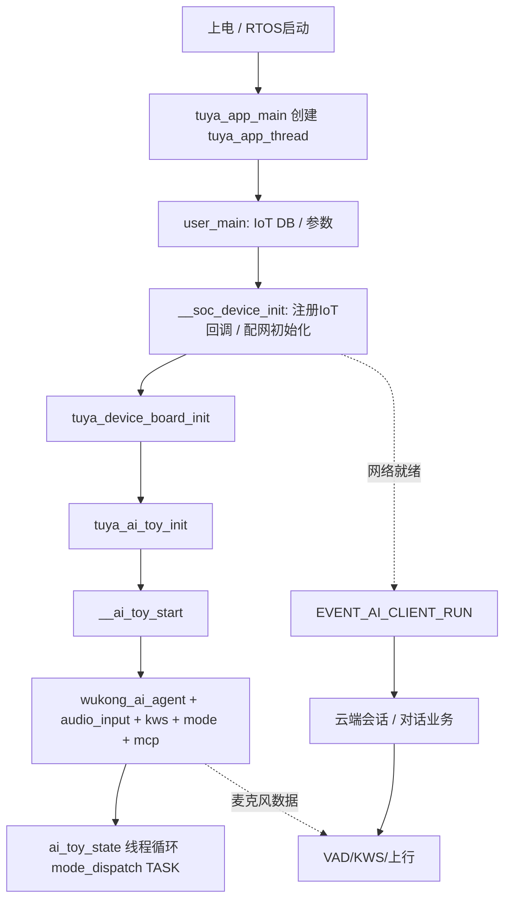

# T5 + TuyaOS + Wukong AI 参考工程：架构与开发指南

> **适用范围**：本文档基于仓库内  
> `T5_TuyaOS-3.13.6/software/TuyaOS/apps/tuyaos_demo_wukong_ai`  
> 及外层 `T5_TuyaOS-3.13.6/software/TuyaOS` 的典型构建结构整理，面向在涂鸦 T5 平台上做 **养老机器人类** 二次开发（跌倒检测、大模型对话、UI、语音唤醒等）。

---

## 〇、文档与代码对照关系

| 概念 | 仓库中的典型路径 |
|------|------------------|
| **整机 SDK 构建根** | `software/TuyaOS/Makefile`、`software/TuyaOS/build/`、`software/TuyaOS/scripts/` |
| **本应用（Wukong AI Demo）** | `software/TuyaOS/apps/tuyaos_demo_wukong_ai/` |
| **应用入口与 IoT 生命周期** | `apps/tuyaos_demo_wukong_ai/src/tuya_app_main.c` |
| **AI 玩具总控（线程、事件、音频链路）** | `apps/tuyaos_demo_wukong_ai/src/tuya_ai_toy.c` |
| **Wukong 核心（Agent / 音视频 / MCP）** | `apps/tuyaos_demo_wukong_ai/src/wukong/` |
| **对话模式状态机** | `apps/tuyaos_demo_wukong_ai/src/mode/` |
| **板级 BSP + UI 资源** | `apps/tuyaos_demo_wukong_ai/src/boards/` |
| **外设驱动（TAL/TDD）** | `apps/tuyaos_demo_wukong_ai/src/drivers/` |
| **GUI / 播放器 / 杂项能力** | `apps/tuyaos_demo_wukong_ai/src/miscs/` |
| **编译单元与宏开关** | `apps/tuyaos_demo_wukong_ai/local.mk`、`build/tuya_app.config`、`build/tuya_iot.config` |
| **Kconfig 主文件与各板默认配置** | `apps/tuyaos_demo_wukong_ai/build/APPconfig`、`build/appconfig/*` |
| **官方模块索引** | `apps/tuyaos_demo_wukong_ai/README_CN.md`、`src/wukong/README_CN.md` |

---

## 一、软件架构（分层视图）

整体可理解为 **「TuyaOS 内核 + IoT 云端协议栈」** 在上，**「本 App」** 在中间，**「板级 BSP / 驱动」** 在下。

### 1.1 分层总表

| 层级 | 职责 | 典型代码位置 | 与养老机器人关系 |
|------|------|----------------|------------------|
| **L7 产品业务** | 跌倒告警策略、护理话术、家属通知逻辑 | 建议在 **新建模块** 或 `mode/`、`skills/` 扩展 | 主要写你自己的差异化 |
| **L6 AI 编排** | Agent、会话、技能、MCP、模式分发 | `src/wukong/wukong_ai_agent.c`、`src/wukong/mcp/`、`src/mode/` | 对话与云端能力扩展入口 |
| **L5 多媒体管线** | 采集 → 前端(AEC/VAD) → KWS → 上行云端 → TTS 播放 | `src/wukong/audio/`、`src/tuya_ai_toy_camera.c`、`src/wukong/video/`、`src/wukong/picture/` | 跌倒检测、唤醒、摄像头必选 |
| **L4 设备抽象（TAL/TDD）** | 统一 OS/驱动接口 | `src/drivers/**`、`adapter/`（SDK 侧）、`tal_*` API | 换屏、换传感器时改这里 |
| **L3 板级 BSP** | 上电 pinmux、电源、背光、具体硬件差异 | `src/boards/<BOARD>/tuya_device_board.c` 等 | 你的 PCB 与参考 EVB 的差异 |
| **L2 Tuya IoT 设备模型** | 配网、MQTT、DP、OTA、授权 | `src/tuya_app_main.c` 内 `tuya_iot_*`、`__soc_dev_*_cb` | 尽量只 **注册回调**，不改协议栈内部 |
| **L1 RTOS / TuyaOS** | 调度、网络栈、文件系统等 | `vendor/.../tuyaos`、`adapter`、`components`（SDK） | **禁止** 随意 fork 修改 |

### 1.2 `tuyaos_demo_wukong_ai` 目录心智模型

```
apps/tuyaos_demo_wukong_ai/
├── local.mk                 # 把哪些 .c 编进来、宏与 include 路径（极其重要）
├── build/
│   ├── APPconfig            # Kconfig：功能开关、模式、板型 choice（与 appconfig/ 目录并存时注意大小写）
│   └── appconfig/           # 各板型默认 .config 快照（make app_config_choice 选用）
├── include/                 # 应用对外头文件
├── scripts/                 # 部分脚本与辅助（若有）
└── src/
    ├── tuya_app_main.c      # main/tuya_app_main → user_main → __soc_device_init
    ├── tuya_ai_toy.c        # AI 总控：事件订阅、__ai_toy_start、音频+Agent 初始化、模式任务
    ├── tuya_ai_toy_key.c / *_led.c / *_camera.c …
    ├── boards/              # 按板型分的 BSP 与 ui/
    ├── drivers/             # key、led、camera、display、tp、imu…
    ├── mode/                # hold / oneshot / wakeup / free talk / p2p / translate …
    ├── miscs/               # LVGL 封装、播放器、uart_codec、相册等
    └── wukong/              # Agent、audio、skills、mcp、cron、tm、video、picture…
```

### 1.3 SDK 构建层（应用以外的「大环境」）

在 `software/TuyaOS/Makefile` 中可见：

- `include build/build_param`、`scripts/mk/xmake.mk`：`OUTPUT_DIR`、xmake 编译框架。
- `-include apps/$(APP_NAME)/local.mk`：选中当前 App 时并入你的 `local.mk`。
- `-include apps/$(APP_NAME)/build/tuya_app.config`：App 级功能开关。

**含义**：改功能不仅要改 C 代码，还要确认 **`tuya_app.config` / `local.mk` / `APPconfig`** 是否打开了对应编译开关。

---

## 二、执行流程（从芯片上电到业务运行）

### 2.1 启动调用链（代码级顺序）

下列顺序与 `tuya_app_main.c`、`tuya_ai_toy.c` 中的注释及实现一致。

```text
main() 或 tuya_app_main()
  └─ tal_thread_create_and_start(..., tuya_app_thread, ...)
       └─ tuya_app_thread()
            ├─ tuya_base_utilities_init()
            ├─（可选）TUYA_LwIP_Init()
            └─ user_main()
                 ├─ tuya_reset_netconfig_init()
                 ├─（可选）蜂窝相关 boot / linkpolicy
                 ├─ tuya_iot_init_params(...)        // IoT DB / 运行参数
                 └─ __soc_device_init()
                      ├─ ty_subscribe_event(EVENT_LINK_UP/DOWN, ...)
                      ├─ ty_subscribe_event(EVENT_MQTT_CONNECTED, ...)
                      ├─（UUID/AUTHKEY 或 MF 产测授权分支）
                      ├─ TY_IOT_CBS_S 注册：gw_status / ug / reset / dp_obj / dp_raw / dp_query …
                      ├─ tuya_iot_wf_soc_dev_init(...) 或 tuya_iot_soc_init(...) 等 // WiFi/蜂窝/纯SOC 分支
                      ├─ tuya_device_board_init()       // 板级硬件
                      ├─（ENABLE_TUYA_UI）tuya_ai_display_init()
                      ├─（可选）log_seq_set_enable(FALSE)
                      └─ tuya_ai_toy_init(&ai_toy_cfg)
                           ├─ __ai_toy_config_load()
                           ├─ LED / Key 初始化
                           ├─（ENABLE_TUYA_CAMERA）tuya_ai_toy_camera_init()
                           ├─ idle_timer / lowpower_timer
                           └─ __ai_toy_start()
```

### 2.2 `__ai_toy_start()` 内部（AI 工作态「接线」）

源码顺序概要（`tuya_ai_toy.c`）：

```text
__ai_toy_start()
  ├─ ty_subscribe_event(EVENT_OTA_PROCESS_NOTIFY / FAILED …)
  ├─ ty_subscribe_event(EVENT_AI_CLIENT_RUN → __on_ai_toy_ai_client_run)
  ├─ ty_subscribe_event(EVENT_WUKONG_KWS_WAKEUP → __on_ai_toy_audio_kws)
  ├─ ty_subscribe_event(EVENT_AUDIO_VAD → __on_ai_toy_vad_change)
  ├─ ty_subscribe_event(EVENT_RESET → __on_ai_toy_reset)
  ├─ __ai_toy_wukong_ai_agent_init()
  │    ├─ wukong_ai_agent_init(__on_ai_toy_wukong_ai_event)
  │    ├─ wukong_audio_player_init()
  │    ├─ wukong_audio_input_init(&audio_cfg)   // board 或 UART，输出回调 __on_ai_toy_mic_data
  │    ├─ wukong_audio_player_set_vol(...)
  │    └─ wukong_kws_default_init()
  ├─（WiFi）tuya_iot_reg_get_wf_nw_stat_cb(...)
  ├─（ENABLE_APP_AI_MONITOR）tuya_ai_monitor_init(...)
  ├─（ENABLE_TUYA_TOOLKITS）wukong_ai_mcp_init()
  ├─ wukong_cron_init()
  ├─ wukong_time_manage_init()
  ├─ wukong_ai_mode_init()
  └─ tal_thread_create_and_start(..., __ai_toy_task, ...)   // 线程名 ai_toy_state
```

### 2.3 运行时「主循环」与事件分发

| 机制 | 函数 / 说明 |
|------|-------------|
| **模式调度线程** | `__ai_toy_task()`：`while (running) { wukong_ai_mode_dispatch(AI_MODE_OP_TASK, ...); tal_system_sleep(20); }` |
| **云端 AI 下行事件** | `__on_ai_toy_wukong_ai_event()` → `wukong_ai_mode_dispatch(AI_MODE_OP_EVENT, ...)` |
| **KWS 唤醒** | `EVENT_WUKONG_KWS_WAKEUP` → `__on_ai_toy_audio_kws()` → `wukong_ai_mode_dispatch(AI_MODE_OP_WAKEUP, ...)` |
| **VAD 起停** | `EVENT_AUDIO_VAD` → `__on_ai_toy_vad_change()` → `wukong_ai_mode_dispatch(AI_MODE_OP_VAD, ...)` |
| **AI Client 已连接** | `EVENT_AI_CLIENT_RUN` → 可选 `tal_workq_schedule` 创建默认会话 → `AI_MODE_OP_CLIENT` |
| **空闲进入 idle** | `idle_timer` → `AI_MODE_OP_NOTIFY_IDLE` |
| **按键逻辑** | `tuya_ai_toy_key.c` 等 → 往往落到 `wukong_ai_mode_dispatch(AI_MODE_OP_KEY, ...)` |

### 2.4 流程图（Mermaid）



### 2.5 配网、MQTT 与「能不能上网对话」

- **配网 / 激活**：在 `__soc_device_init()` 中通过 `tuya_iot_wf_soc_dev_init` 或等价接口启动；按键长按复位配网等在 `tuya_ai_toy_key.c` 等处调用 `tuya_iot_wf_gw_fast_unactive` 等 API。
- **链路事件**：`EVENT_LINK_UP`、`EVENT_MQTT_CONNECTED` 等在 `tuya_app_main.c` 早期订阅，用于网络状态提示与后续逻辑。
- **对话就绪**：`EVENT_AI_CLIENT_RUN` 触发后，`__on_ai_toy_ai_client_run` 可选异步创建默认会话，并通知模式层 `AI_MODE_OP_CLIENT`。

---

## 三、可修改 / 谨慎修改 / 禁止修改（函数与模块级）

> 说明：**禁止修改** 指不要直接改 TuyaOS/云端协议栈闭源或内核实现；业务上仍可通过 **合法回调与 DP** 扩展。

| 类别 | 对象 | 位置（示例） | 建议 |
|------|------|----------------|------|
| **可扩展** | 新建业务模块：跌倒检测任务、传感器融合、电机 PID | `src/` 下新建目录 + 在 `local.mk` 添加源文件 | 解耦、易测试 |
| **可扩展** | `wukong_ai_mode_dispatch` 各模式分支、护理场景状态 | `src/mode/` | 产品逻辑主战场 |
| **可扩展** | `skill_*`、自定义 MCP tool | `src/wukong/skills/`、`src/wukong/mcp/tools/` | 云端工具调用扩展 |
| **可扩展** | UI 页面、主题、交互 | `src/miscs/gui/tuya_lvgl*`、`src/boards/*/ui/` | LVGL 为主 |
| **可扩展** | DP 业务映射（音量、自定义枚举 DP） | `tuya_ai_toy_dp_process()`、`miscs/gui/dp2widget` 相关 | 与云平台 DP 表一致 |
| **可扩展** | KWS 适配层（接入第三方唤醒） | `src/wukong/audio/frontend/kws/` | 保持 `wukong_kws_event` 契约 |
| **谨慎** | `user_main`、`__soc_device_init` | `tuya_app_main.c` | 一动可能影响授权、联网、回调注册 |
| **谨慎** | `__ai_toy_start` / `__ai_toy_stop` 事件订阅顺序 | `tuya_ai_toy.c` | 漏订阅会导致唤醒/OTA 行为异常 |
| **谨慎** | 板级 `tuya_device_board.c`、camera/display 驱动 | `src/boards/`、`src/drivers/` | 与时钟、DMA、引脚强相关 |
| **谨慎** | `wukong_audio_input_init` 参数（采样率、帧长、VAD 模式） | `__ai_toy_wukong_ai_agent_init` | 影响唤醒率与延迟 |
| **禁止（原则上）** | TuyaOS 内核调度、TCP/IP 栈内部、安全加密实现 | SDK `vendor/`、`adapter` 闭源部分 | 升级不可维护 |
| **禁止（原则上）** | 篡改 DP/MQTT 封包层、`tuya_iot_*` 内部协议流程 | 静态库 / SDK | 易导致认证失败、不合规 |

---

## 四、养老机器人四类需求的落地路径

### 4.1 视频跌倒检测

**建议接入点**

1. **图像源**：复用 `tuya_ai_toy_camera_init()` 与板级 `tuya_device_camera.c` 建立的采集链路；若有独立 ISP/YUV 通路，在 **camera 回调** 或 `wukong_video_input.c` 同级增加抽象。
2. **算力与实时性**：新建 **`fall_detect` 任务**（优先级建议介于采集与高优先级音频之间），使用 **无锁环形队列** 传递「帧描述符」（指针 + 时间戳），避免在 ISR/采集线程内跑推理。
3. **与现有任务协同**：勿阻塞 `__ai_toy_task`；告警结果通过：
   - `wukong_ai_mode_dispatch(...)` 触发语音提示 / 切换模式；
   - 或 `tuya_ai_toy_dp_process` / 涂鸦云上报警 DP（需云端点位定义一致）；
   - UI：`tuya_ai_display_msg` 或 LVGL 页面弹窗。

**算法选项（产品向）**

- 端侧轻量模型（姿态/骨骼简化）+ **置信度 + 时间窗** 抑制误报；
- 或将关键帧 **JPEG** 经现有 picture/video 通道送云端二次判别（延迟更高）。

### 4.2 AI 联网（云端大模型对话）

**现状**：工程已集成 **`wukong_ai_agent`**（见 `src/wukong/wukong_ai_agent.c` 与 `README_CN.md`），负责与涂鸦云端 AI 服务交互、文本流、媒体与会话。

**建议**

1. **优先** 在 Agent / Skills / MCP 上扩展「护理工具」（服药提醒、跌倒上报、呼叫家属），避免自建 MQTT 通道与云端重复造轮子。
2. 若必须用第三方 HTTP API：**新建独立模块**，用 `tal_workq` 或专用线程，禁止阻塞音频与模式线程。
3. 会话生命周期：`EVENT_AI_CLIENT_RUN` →（可选）`tuya_ai_agent_crt_session` 异步创建（见 `__on_ai_toy_ai_client_run`）。

### 4.3 UI 修改（换屏、布局、交互）

**层次**

1. **驱动**：`src/drivers/app_tuya_display/`（`tdd_lcd_driver`、`tal_display`）——分辨率、时序、翻转、帧缓冲。
2. **框架**：`src/miscs/gui/tuya_lvgl/`、`tuya_lvgl_*` 封装 —— 页面路由、资源加载。
3. **板级页面**：`src/boards/<BOARD>/ui/` —— 具体产品界面。

**建议**：先固定一套 **显示刷新与触摸坐标映射**，再改 UI；否则 LVGL 逻辑会反复返工。

### 4.4 关键词唤醒（第三方 SDK）

**现有链路**（代码已实现闭环）：

`wukong_audio_input_*` → `__on_ai_toy_mic_data` → 前端 `wukong_audio_frontend_*` → `wukong_kws_feed_with_vad` → `EVENT_WUKONG_KWS_WAKEUP` → `wukong_ai_mode_dispatch(AI_MODE_OP_WAKEUP)`。

**接入第三方**

1. 在 `src/wukong/audio/frontend/kws/` 增加 vendor 目录，实现与现有 **feed/event** 对齐的适配层。
2. **初始化时机**：在 `wukong_kws_default_init()` 或 `__ai_toy_wukong_ai_agent_init` 尾部挂载，确保采样率、帧长与前端一致。
3. **授权与资源**：三方模型文件放 Flash/FS，注意授权许可与 `.gitignore` 中大资源策略。

---

## 五、构建、配置与调试清单

### 5.1 常用配置入口

| 目的 | 文件 / 命令 |
|------|-------------|
| 打开某驱动/GUI 源文件是否参与编译 | `apps/tuyaos_demo_wukong_ai/local.mk`、`build/tuya_app.config` |
| 全局 IoT 能力（音频子系统等） | `software/TuyaOS/build/tuya_iot.config` |
| 功能菜单与默认值 | `build/APPconfig`、`make app_config_choice APP_NAME=tuyaos_demo_wukong_ai` |
| 产物输出目录 | `**/software/TuyaOS/output/`（勿与源码目录 `audio/output` 混淆） |

### 5.2 推荐阅读顺序（官方自带）

1. `apps/tuyaos_demo_wukong_ai/README_CN.md` — 总览与入口表  
2. `src/wukong/README_CN.md` — Agent / 技能 / MCP  
3. `src/wukong/audio/README_CN.md`、`audio/frontend/kws/README_CN.md` — 音频与唤醒  
4. `src/boards/README_CN.md` — 板级迁移  
5. `build/README_CN.md` — 配置与编译说明（若存在）

---

## 六、总结与开发建议

1. **先锁硬件再锁算法**：display/camera/mic 三通后再做跌倒与唤醒，否则性能数据无效。  
2. **业务进 mode/skills，协议进 DP**：不要把护理逻辑写进 `tuya_iot_*` 内部假设里。  
3. **线程模型**：采集薄、推理厚、UI 中；严禁在麦克风回调里长时间阻塞。  
4. **Windows 克隆注意**：`build/appconfig/`（目录）与 `build/APPconfig`（文件）仅大小写不同，在 **大小写不敏感** 文件系统上会冲突；建议在 Linux/WSL 区分大小写环境开发该仓库。

---

## 附录：关键符号速查

| 符号/API | 含义 |
|---------|------|
| `wukong_ai_mode_dispatch` | 模式层统一入口（TASK/EVENT/WAKEUP/VAD/KEY/CLIENT…） |
| `wukong_ai_agent_init/send_*` | 云端 AI 会话与多媒体上行 |
| `wukong_kws_*` | 关键词唤醒管线 |
| `tuya_iot_wf_soc_dev_init` | Wi-Fi SOC 类设备初始化（分支依赖宏） |
| `TY_IOT_CBS_S` | DP、OTA、复位等回调集合 |

---

*文档生成说明：结构与调用链已与当前仓库 `tuya_app_main.c`、`tuya_ai_toy.c` 对照；若你升级 SDK 版本，请以实际源码为准做一次 diff 核对。*
