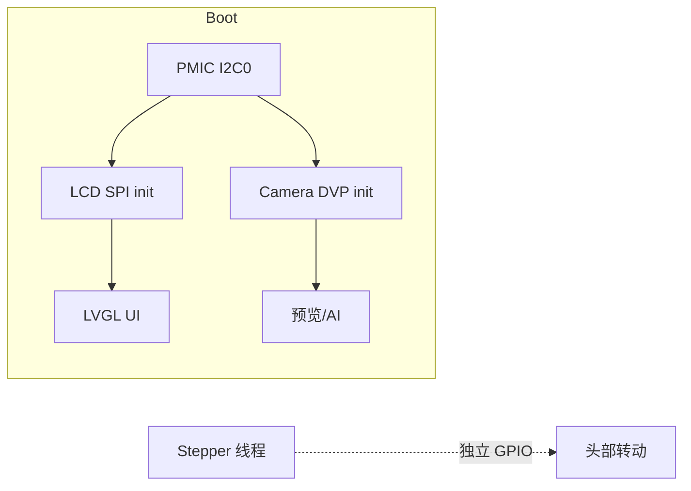

# 产品板软硬件接口需求表

| 项目 | 内容 |
|------|------|
| 文档版本 | v1.3.1 |
| 生成日期 | 2026-06-16 |
| 原理图/网表来源 | `Circuit/Netlist_Schematic1_2026-06-16.tel` |
| 模组规格 | **U32：T5-E1-IPEX**（BK7258 / TuyaOS T5） |
| 引脚定义依据 | `Docs/T5-E1-IPEX_模组硬件设计_涂鸦开发者平台_涂鸦开发者平台.pdf` **§2.2** |
| 固件工程 | `tuyaos_demo_wukong_ai`（TuyaOS 3.13.6） |
| 适用读者 | 嵌入式软件、硬件调试、产测 |

---

## 1. 文档说明

### 1.1 引脚编号约定（重要）

T5-E1-IPEX 模组 **Pin 序号（1～70）≠ GPIO 编号（0～55）**，二者通过 **丝印 I/O 名称（Px）** 关联。

| 列名 | 含义 | 示例 |
|------|------|------|
| **Pin（序号）** | 模组物理引脚序号，网表 `U32.x` 中的 `x` | Pin 4 |
| **丝印名称** | 模组表面印刷的 I/O 名 | P20 |
| **GPIO 名称** | 芯片 GPIO 编号，对应 SDK `TUYA_GPIO_NUM_x` / `TUYA_IO_PIN_x` | GPIO20 |
| **TuyaOS 枚举** | 代码中写法 | `TUYA_GPIO_NUM_20` |
| **Pinmux** | `tkl_io_pinmux_config()` 建议配置的复用功能 | `TUYA_IIC0_SCL` |
| **本板网络名** | 本产品原理图网络名（来自网表） | I2C_SYS_SCL |

**收录原则：** 本文档 **仅列出产品实际使用的引脚与网络**。网表中虽有名但仅接 T5 悬空、或仅接测试点而无功能外设者（如 `AUD_SCL0`、`GPIO_AI`、`LED_0` 等）**不收录**。

特殊引脚（无 GPIO 编号）：

| Pin | 丝印 | 类型 | 说明 |
|-----|------|------|------|
| 1, 40, 60 | GND | P | 电源地 |
| 2 | 3V3 | P | 模组供电 3.3V |
| 3 | RST | I | 硬件复位，低有效（内部上拉） |
| 13 | DN | I/O | USB D- |
| 14 | DP | I/O | USB D+ |
| 36 | RXD | I/O | UART0_RX / DL_UART_RX（烧录口） |
| 37 | TXD | I/O | UART0_TX / DL_UART_TX（烧录口） |
| 61 | LN | AO | 音频左声道负（AUDL_N） |
| 62 | LP | AO | 音频左声道正（AUDL_P） |
| 66 | MP1 | AO | 麦克风 1 正（MIC1_P） |
| 67 | MN1 | AO | 麦克风 1 负（MIC1_N） |
| 68 | MN2 | AO | 麦克风 2 负（MIC2_N） |
| 69 | MP2 | AO | 麦克风 2 正（MIC2_P） |
| 70 | MBS | AO | 麦克风偏置（MICBIAS） |

> **注意：** 本 PCB 为定制产品板，功能组合（DVP 摄像头 + SPI LCD + 4G + VC-02 + 双步进电机 + IMU/ALS）**不完全等同**任一官方 `T5AI_BOARD_*` 参考板型，需新建板级目录或扩展现有 `tuya_device_board.c`。

**收录原则：** 本文档 **仅列出产品实际使用的引脚与网络**。网表中虽有名但仅接 T5 悬空、或仅接测试点而无功能外设者（如 `AUD_SCL0`、`GPIO_AI`、`LED_0` 等）**不纳入功能接口表**（测试点见 §7）。

### 1.2 网表为电路唯一依据

**凡引脚、网络名、连接器 Pin 序号、位号连接关系，均以 `Circuit/Netlist_Schematic1_2026-06-16.tel` 为准。** 模组 Pin↔GPIO↔丝印对照仍引用 T5-E1-IPEX §2.2；若网表 `U32.x` 与 §2.2 冲突，以网表连接关系为准并标注待硬件复核。

网表已确认的关键器件位号：

| 位号 | 网表封装/型号 | 网络/用途 |
|------|---------------|-----------|
| U32 | T5-E1-IPEX | 主控模组 |
| U24 / U36 | ULN2003AIPWR | 步进驱动 M0 / M1 |
| U35 | MT3608 | 5V 升压 → CN16/CN17 |
| CN4 | BX-FPC1.0-2H10PX 10P | SPI LCD（FPC） |
| FPC1 | AFC01-S24FCA-00 24P | DVP 摄像头座 |
| Q1 / Q2 | 2SK3018 | CIS I2C 电平转换 |
| Q9 | SI2302 | LCD 背光 LEDK 开关 |
| CARD1 | TF PUSH | microSD |

> Sensor 型号 **GC2145**、LCD 模组 **HXR0336N011** 来自 BOM/器件手册；**网表只到 FPC1/CN4 连接器**，不在网表中写出芯片型号。

### 1.3 与悟空 SDK 参考板型关系

| 本板硬件特征 | 最接近 SDK 板型 | 差异摘要 |
|--------------|-----------------|----------|
| DVP 摄像头 FPC1（**GC2145**） | `T5AI_BOARD` | CIS 引脚按 §2.2；复位 P51；I2C 与 I2C_SYS 共用 P20/P21 |
| SPI LCD CN4（**HXR0336N011 + ST7789**） | `T5AI_BOARD_ROBOT`（SPI 模板） | 240×320 SPI0；P44/P45/P46/P47/P43/P42 |
| ULN2003 ×2 + **28BYJ48** | 无现成驱动 | M0/M1 GPIO 见 §5.8；需自研半步驱动，见 §9.3 |
| VC-02 语音 + 板载麦 | 板载音频方案 | UART0：RXD/TXD（Pin 36/37） |
| L511 4G Cat.1 | `ENABLE_CELLULAR_DONGLE` | USB Pin13/14 + 复位 P52/GPIO52 |
| BMI270 + BH1750 | `T5AI_BOARD_DESKTOP`（IMU 类） | I2C0：P20/P21（Pin 4/5） |

---

## 2. T5-E1-IPEX 模组引脚总表（§2.2 官方定义）

> 来源：涂鸦《T5-E1-IPEX 模组硬件设计》文档 §2.2。下表为 **70 引脚完整映射**，供软硬件对照基准。

| Pin | 丝印名称 | GPIO | I/O 类型 | 主要复用功能（摘要） | 本板是否使用 | 本板网络名 |
|-----|----------|------|----------|----------------------|--------------|------------|
| 1 | GND | — | P | 电源地 | ✓ | GND |
| 2 | 3V3 | — | P | 模组电源 3.3V | ✓ | 3V3_T5 |
| 3 | RST | — | I | 硬件复位，低有效 | ✓ | T5_RST |
| 4 | P20 | **GPIO20** | I/O | I2C0_SCL / SWCLK / RGB_R6 | ✓ | I2C_SYS_SCL |
| 5 | P21 | **GPIO21** | I/O | I2C0_SDA / SWDIO / ADC6 | ✓ | I2C_SYS_SDA |
| 6 | P22 | **GPIO22** | I/O | CLK26M / QSPI0_SCK / RGB_R4 | ✓ | M0_A |
| 7 | P23 | **GPIO23** | I/O | QSPI0_CS / RGB_R3 | ✓ | M0_B |
| 8 | P24 | **GPIO24** | I/O | QSPI0_IO0 / RGB_G7 | ✓ | M0_C |
| 9 | P25 | **GPIO25** | I/O | QSPI0_IO1 / RGB_G6 | ✓ | M0_D |
| 10 | P26 | **GPIO26** | I/O | QSPI0_IO2 / RGB_G5 | ✓ | VC02_KWS |
| 11 | P28 | **GPIO28** | — | （未用；**TP19** 接 U32.11） |
| 12 | P1 | **GPIO1** | I/O | UART1_RX / I2C1_SDA | ✓ | LOG_RX |
| 13 | DN | — | I/O | USB D- | ✓ | USB_4G_DM |
| 14 | DP | — | I/O | USB D+ | ✓ | USB_4G_DP |
| 15 | P0 | **GPIO0** | I/O | UART1_TX / I2C1_SCL | ✓ | LOG_TX |
| 16 | P9 | **GPIO9** | I/O | I2S0_DOUT / DMIC_DAT | ✓ | IR_EN |
| 17 | P8 | **GPIO8** | I/O | I2S0_DIN / DMIC_CLK | ✓ | SD_CD |
| 18 | P7 | **GPIO7** | I/O | I2S0_SYNC / QSPI1_IO3 | ✓ | SD_D3 |
| 19 | P6 | **GPIO6** | I/O | I2S0_SCK / QSPI1_IO2 | ✓ | SD_D2 |
| 20 | P5 | **GPIO5** | I/O | SPI1_MISO / SDIO_DATA1 | ✓ | SD_D1 |
| 21 | P4 | **GPIO4** | I/O | SPI1_MOSI / SDIO_DATA0 | ✓ | SD_D0 |
| 22 | P3 | **GPIO3** | I/O | SPI1_CSN / SDIO_CMD | ✓ | SD_CMD |
| 23 | P2 | **GPIO2** | I/O | SPI1_SCK / SDIO_CLK | ✓ | SD_CLK |
| 24 | P12 | **GPIO12** | I/O | UART0_RTS / TOUCH0 / ADC14 | ✓ | ADC_KEY |
| 25 | P13 | **GPIO13** | I/O | UART0_CTS / TOUCH1 / ADC15 | — | （未用） |
| 26 | P15 | **GPIO15** | I/O | SDIO_CMD / SPI0_CSN | — | （未用） |
| 27 | P14 | **GPIO14** | I/O | SDIO_CLK / SPI0_SCK | ✓ | SOS |
| 28 | P16 | **GPIO16** | I/O | SDIO_DATA0 / SPI0_MOSI | — | （未用，`LED_0` 仅接 U32） |
| 29 | P17 | **GPIO17** | I/O | SDIO_DATA1 / SPI0_MISO | ✓ | SPK_CTL |
| 30 | P18 | **GPIO18** | I/O | SDIO_DATA2 / RGB_VSYNC | ✓ | M1_C |
| 31 | P19 | **GPIO19** | I/O | SDIO_DATA3 / RGB_R7 | ✓ | M1_D |
| 32 | P47 | **GPIO47** | I/O | SPI0_MISO / I2S2_DOUT | ✓ | LCD_D/C |
| 33 | P46 | **GPIO46** | I/O | SPI0_MOSI / I2S2_DIN | ✓ | LCD_SDI |
| 34 | P45 | **GPIO45** | I/O | SPI0_CSN / I2S2_SYNC | ✓ | LCD_CS |
| 35 | P44 | **GPIO44** | I/O | SPI0_SCK / I2S2_SCK | ✓ | LCD_SCLK |
| 36 | RXD | — | I/O | UART0_RX / DL_UART_RX / SDIO_DATA2 | ✓ | UART0_RX |
| 37 | TXD | — | I/O | UART0_TX / DL_UART_TX / SDIO_DATA3 | ✓ | UART0_TX |
| 38 | P43 | **GPIO43** | I/O | I2S1_DOUT / RGB_B7 | ✓ | LCD_RST |
| 39 | P42 | **GPIO42** | I/O | I2S1_DIN / RGB_G2 | ✓ | LCD_BL |
| 40 | GND | — | P | 电源地 | ✓ | GND |
| 41 | P27 | **GPIO27** | I/O | CIS_MCLK / QSPI0_IO3 | ✓ | DVP_MCLK |
| 42 | P29 | **GPIO29** | I/O | CIS_PCLK / TOUCH3 | ✓ | DVP_PCLK |
| 43 | P50 | **GPIO50** | I/O | ENET_RXD1 / RGB_R0 | ✓ | M1_A |
| 44 | P49 | **GPIO49** | I/O | ENET_RXD0 / RGB_R1 | ✓ | M1_B |
| 45 | P41 | **GPIO41** | I/O | UART2_TX / I2S1_SYNC | ✓ | PWRKEY_CTRL |
| 46 | P31 | **GPIO31** | I/O | CIS_VSYNC / UART2_TX | ✓ | DVP_VSYNC |
| 47 | P30 | **GPIO30** | I/O | CIS_HSYNC / UART2_RX | ✓ | DVP_HSYNC |
| 48 | P33 | **GPIO33** | I/O | CIS_PXD1 / ENET_RXD0 | ✓ | DVP_D1 |
| 49 | P32 | **GPIO32** | I/O | CIS_PXD0 / ENET_MDIO | ✓ | DVP_D0 |
| 50 | P48 | **GPIO48** | I/O | ENET_MDIO / RGB_R2 | — | （未用，`AUD_SCL0` 仅接 U32） |
| 51 | P34 | **GPIO34** | I/O | CIS_PXD2 / SPI0_CSN | ✓ | DVP_D2 |
| 52 | P35 | **GPIO35** | I/O | CIS_PXD3 / SPI0_MOSI | ✓ | DVP_D3 |
| 53 | P53 | **GPIO53** | I/O | ENET_TXD1 / RGB_B2 | — | （未用，`AUD_SCL1` 仅接 U32） |
| 54 | P54 | **GPIO54** | I/O | ENET_TXEN / RGB_B1 | — | （未用，`FLAG_AI` 仅接 TP18） |
| 55 | P55 | **GPIO55** | I/O | ENET_REF_CLK / RGB_B0 | — | （未用，`GPIO_AI` 仅接 U32） |
| 56 | P36 | **GPIO36** | I/O | CIS_PXD4 / ENET_TXD0 | ✓ | DVP_D4 |
| 57 | P37 | **GPIO37** | I/O | CIS_PXD5 / ENET_TXD1 | ✓ | DVP_D5 |
| 58 | P52 | **GPIO52** | I/O | ENET_TXD0 / RGB_G0 | ✓ | RST_CAT |
| 59 | P51 | **GPIO51** | I/O | ENET_RXDV / RGB_G1 | ✓ | DVP_RST |
| 60 | GND | — | P | 电源地 | ✓ | GND |
| 61 | LN | — | AO | AUDL_N 音频左负 | ✓ | AUDLN |
| 62 | LP | — | AO | AUDL_P 音频左正 | ✓ | AUDLP |
| 63 | P38 | **GPIO38** | I/O | CIS_PXD6 / ENET_TXEN | ✓ | DVP_D6 |
| 64 | P39 | **GPIO39** | I/O | CIS_PXD7 / ENET_REF_CLK | ✓ | DVP_D7 |
| 65 | P40 | **GPIO40** | I/O | UART2_RX / I2S1_SCK | — | （未用，`UART_RX_AI` 仅接 TP17） |
| 66 | MP1 | — | AO | MIC1_P 麦克风 1 正 | ✓ | MICP1 |
| 67 | MN1 | — | AO | MIC1_N 麦克风 1 负 | ✓ | MICN1 |
| 68 | MN2 | — | AO | MIC2_N 麦克风 2 负 | ✓ | MICN2_T5 |
| 69 | MP2 | — | AO | MIC2_P 麦克风 2 正 | ✓ | MICP2_T5 |
| 70 | MBS | — | AO | MICBIAS 麦克风偏置 | ✓ | MICBIAS |

---

## 3. 系统框图

```
                    ┌─────────────────────────────────────────┐
  USB-C ──VBUS──►   │  AXP2101 (U4)  PMIC / 充电 / 多路电源   │
  电池 VBAT ─────►  │  I2C0: P20/P21 (Pin4/5, GPIO20/21)    │
                    └──────────┬──────────────────────────────┘
                               │
         ┌─────────────────────┼─────────────────────┐
         ▼                     ▼                     ▼
   ┌───────────┐        ┌────────────┐        ┌─────────────┐
   │ T5 U32    │◄─UART─►│ VC-02 U1   │        │ L511 4G U40 │
   │ BK7258    │◄─USB──►│ 语音/KWS   │        │ Cat.1+SIM   │
   └─────┬─────┘        └────────────┘        └─────────────┘
         │
    ┌────┴────┬──────────┬─────────┬──────────┬──────────┐
    ▼         ▼          ▼         ▼          ▼          ▼
 DVP CAM   SPI LCD    SDIO TF    I2C IMU/ALS  ULN×2     CS8302
 FPC1      CN4        CARD1      BMI270/      步进M0/M1  喇叭
                                 BH1750
```

---

## 4. 电源域接口（硬件测量 + 软件电源管理）

| 电源网络 | 典型电压 | 主要负载 | PMIC/来源 | 软件/调试要点 |
|----------|----------|----------|-----------|---------------|
| VBUS | 5V | USB-C、CH342、充电输入 | U50 → AXP2101 | 万用表测 CN21 |
| VBAT | 3.0～4.2V | 锂电池 | CN20 → U4.33 | 电池座 CN20 |
| AXP_PS | 3.3V 主域 | 4G、升压、大电流负载 | AXP2101 SWOUT | 上电第一步测量 |
| 3V3_T5 | 3.3V | **U32 Pin2** | L13 滤波 | 无此电压 T5 不工作 |
| VDD_3V3 | 3.3V | 数字外设、LCD IO | AXP2101 | |
| VDD_3V3_SD | 3.3V | TF 卡独立供电 | AXP2101 LDO/DCDC | TF 不识卡先查此轨 |
| DVDD_1V8 | 1.8V | 摄像头数字 | FPC1.10 | |
| AVDD_2V8 | 2.8V | 摄像头模拟 | FPC1.4 | |
| VDDCAM_2V8 | 2.8V | 摄像头 IO/传感器 | FPC1.11 | CIS I2C 电平转换 Q1/Q2 |
| CAT1_1.8V | 1.8V | 4G 模组 IO | U40.24 | |
| 5V | 5V | 步进电机驱动 | MT3608 U35 升压 | CN16/CN17 Pin1 |
| SIM_VDD | 1.8/3V0 | SIM 卡 | U40 控制 | |
| RTC_VDD | — | RTC 保持 | AXP2101 | |

### 4.1 电源相关信号

| 功能 | 网络名 | Pin | 丝印 | GPIO | 连接器件 | 方向 | 有效电平 | 软件模块 |
|------|--------|-----|------|------|----------|------|----------|----------|
| 硬件电源键 | PWR_KEY | — | — | — | SW1 → AXP2101.30 | 输入 | 低有效 | `tuya_ai_toy_key` |
| PMIC 唤醒 | AXP_WAKEUP | — | — | — | R5 → U4.38 | 输入 | — | AXP2101 |
| 电源键控制 | PWRKEY_CTRL | 45 | P41 | GPIO41 | U32 → 逻辑 | 输出 | — | 板级电源 |
| 电源好 | AXP_PG | — | — | — | U4.29 → **TP7** | 输出 | 高=好 | 产测 |
| 充电 LED | AXP_CHG_LED | — | — | — | LED4 | 输出 | — | 硬件 |
| 电池温度 | TS | — | — | — | U4.31 NTC | 模拟 | — | AXP2101 |
| T5 硬复位 | T5_RST | 3 | RST | — | RC 网络 | 输入 | 低复位 | 上电时序 |
| 4G 模组复位 | RST_CAT | 58 | P52 | GPIO52 | U40 | 输出 | 低复位 | `tuya_ai_cellular` |
| 摄像头复位 | DVP_RST | 59 | P51 | GPIO51 | FPC1.6 | 输出 | 低复位 | `tuya_ai_toy_camera` |
| 功放使能 | SPK_CTL | 29 | P17 | GPIO17 | U8 → **TP15** | 输出 | 依硬件 | `TUYA_AI_TOY_SPK_EN_PIN` |

---

## 5. T5 各功能模块引脚分配（本板使用）

> 下列各表均包含 **Pin（序号）/ 丝印名称 / GPIO 名称 / 本板网络名**，便于软硬件联调。

### 5.1 系统 I2C（I2C0 / I2C_SYS）

| 功能 | 网络名 | Pin | 丝印 | GPIO | TuyaOS | Pinmux | 挂载器件 | I2C 地址 |
|------|--------|-----|------|------|--------|--------|----------|----------|
| I2C 时钟 | I2C_SYS_SCL | 4 | P20 | GPIO20 | `TUYA_GPIO_NUM_20` | `TUYA_IIC0_SCL` | AXP2101, BMI270, BH1750 | — |
| I2C 数据 | I2C_SYS_SDA | 5 | P21 | GPIO21 | `TUYA_GPIO_NUM_21` | `TUYA_IIC0_SDA` | 同上 | — |

| 位号 | 芯片 | 7-bit 地址 | 用途 | 驱动 |
|------|------|------------|------|------|
| U4 | AXP2101 | 0x34 | 充电/电源 | 板级电源 |
| U15 | BMI270 | 0x68 / 0x69 | IMU | `tuya_imu` |
| U17 | BH1750 | 0x23 / 0x5C | 环境光 | 背光策略 |

### 5.2 UART 接口

| 功能 | 网络名 | Pin | 丝印 | GPIO | Pinmux | 对端 | SDK 端口 |
|------|--------|-----|------|------|--------|------|----------|
| VC-02 接收 | UART0_RX | 36 | RXD | — | `TUYA_UART0_RX` | U1.5 / CN22 | `TUYA_UART_NUM_0` |
| VC-02 发送 | UART0_TX | 37 | TXD | — | `TUYA_UART0_TX` | U1.4 / CN22 | `TUYA_UART_NUM_0` |
| 调试日志 RX | LOG_RX | 12 | P1 | GPIO1 | `TUYA_UART1_RX` | U5 CH342.12 | USB 日志 |
| 调试日志 TX | LOG_TX | 15 | P0 | GPIO0 | `TUYA_UART1_TX` | U5 CH342.13 | USB 日志 |
| 4G 主串口 | MAIN_TX/RX | — | — | — | — | U40（经 R44/R45） | AT 口 |
| 4G 调试 | DBG_TX/RX | — | — | — | — | U40 → **TP4/TP3** | 硬件调试 |

> **说明：** Pin 36/37 为模组 **RXD/TXD** 专用脚，官方定义为 **UART0**（兼烧录授权口），本板用于 VC-02。Pin 12/15（P1/P0）为 **UART1**，接 CH342 作日志口。

### 5.3 USB 接口

| 功能 | 网络名 | Pin | 丝印 | 说明 |
|------|--------|-----|------|------|
| USB D- | USB_4G_DM | 13 | DN | 至 U40 + T5 内部 USB |
| USB D+ | USB_4G_DP | 14 | DP | 至 U40 + T5 内部 USB |
| 4G BOOT | BOOT | — | — | U40.82 → **TP2** |

软件：`CONFIG_ENABLE_CELLULAR_DONGLE`，参考 `src/miscs/cellular/`。

### 5.4 语音与麦克风

| 功能 | 网络名 | Pin | 丝印 | GPIO | 类型 | 对端 | 软件要点 |
|------|--------|-----|------|------|------|------|----------|
| KWS 唤醒 | VC02_KWS | 10 | P26 | GPIO26 | 数字 I/O | U1.16 | GPIO 中断 |
| 麦克风 1+ | MICP1 | 66 | MP1 | — | AO | 板载 MEMS | AFE 通道 1 |
| 麦克风 1- | MICN1 | 67 | MN1 | — | AO | 板载 MEMS | AFE 通道 1 |
| 麦克风 2+（T5） | MICP2_T5 | 69 | MP2 | — | AO | 共用麦 | AFE 通道 2 |
| 麦克风 2-（T5） | MICN2_T5 | 68 | MN2 | — | AO | 共用麦 | AFE 通道 2 |
| 麦偏置 | MICBIAS | 70 | MBS | — | AO | 麦供电 | `wukong_audio_input` |
| 音频左+ | AUDLP | 62 | LP | — | AO | U8 功放 | 板载播放 |
| 音频左- | AUDLN | 61 | LN | — | AO | U8 功放 | 板载播放 |
| 红外使能 | IR_EN | 16 | P9 | GPIO9 | 数字 I/O | CN14（Q10/Q11） | GPIO 输出 |

> **官方要求：** 仅使用一路 MIC 时必须使用 **MIC1（Pin 66/67）**。

### 5.5 DVP 摄像头（FPC1，24P/0.5mm `AFC01-S24FCA-00`，BOM Sensor：**GC2145**）

#### 5.5.1 FPC1 引脚（摘自网表 `$NETS`）

| FPC1 Pin | 网络名 | 连接（网表） | 说明 |
|----------|--------|--------------|------|
| 1 | `$1N192` | 内部网络 | 未接 U32 |
| 2 | GND | — | 地 |
| 3 | CIS_SDA | Q2.3, R29.1 | Sensor I2C 数据 → Q2 |
| 4 | AVDD_2V8 | C19.1, U4.12 | 模拟 2.8V（AXP） |
| 5 | CIS_SCL | Q1.3, R27.1 | Sensor I2C 时钟 → Q1 |
| 6 | DVP_RST | C23.2, R30.1, **U32.59** | 复位，低有效 |
| 7 | DVP_VSYNC | **U32.46** | 场同步 |
| 8 | CIS_PWDM | R31.2 | 经 R31(10kΩ) 至 GND，**无 T5 GPIO** |
| 9 | DVP_HSYNC | **U32.47** | 行同步 |
| 10 | DVDD_1V8 | C18.1, U4.14 | 数字 1.8V |
| 11 | VDDCAM_2V8 | C15.1, R26～30.2, U4.16 | 摄像头 IO 2.8V |
| 12 | DVP_D7 | **U32.64** | 数据 D7 |
| 13 | DVP_MCLK | **U32.41** | 主时钟 |
| 14 | DVP_D6 | **U32.63** | 数据 D6 |
| 15 | GND | — | 地 |
| 16 | DVP_D5 | **U32.57** | 数据 D5 |
| 17 | DVP_PCLK | **U32.42** | 像素时钟 |
| 18 | DVP_D4 | **U32.56** | 数据 D4 |
| 19 | DVP_D0 | **U32.49** | 数据 D0 |
| 20 | DVP_D3 | **U32.52** | 数据 D3 |
| 21 | DVP_D1 | **U32.48** | 数据 D1 |
| 22 | DVP_D2 | **U32.51** | 数据 D2 |
| 23 | `$1N169` | — | 未接 U32 |
| 24 | `$1N170` | — | 未接 U32 |
| 25 | GND | — | 地 |
| 26 | GND | — | 地 |

#### 5.5.2 DVP / I2C 与 T5 引脚对照

| 功能 | 网络名 | Pin | 丝印 | GPIO | 官方信号名 | FPC Pin | Pinmux |
|------|--------|-----|------|------|------------|---------|--------|
| 主时钟 | DVP_MCLK | 41 | P27 | GPIO27 | CIS_MCLK | 13 | CIS MCLK |
| 像素时钟 | DVP_PCLK | 42 | P29 | GPIO29 | CIS_PCLK | 17 | CIS PCLK |
| 行同步 | DVP_HSYNC | 47 | P30 | GPIO30 | CIS_HSYNC | 9 | CIS HSYNC |
| 场同步 | DVP_VSYNC | 46 | P31 | GPIO31 | CIS_VSYNC | 7 | CIS VSYNC |
| 数据 D0 | DVP_D0 | 49 | P32 | GPIO32 | CIS_PXD0 | 19 | CIS PXD0 |
| 数据 D1 | DVP_D1 | 48 | P33 | GPIO33 | CIS_PXD1 | 21 | CIS PXD1 |
| 数据 D2 | DVP_D2 | 51 | P34 | GPIO34 | CIS_PXD2 | 22 | CIS PXD2 |
| 数据 D3 | DVP_D3 | 52 | P35 | GPIO35 | CIS_PXD3 | 20 | CIS PXD3 |
| 数据 D4 | DVP_D4 | 56 | P36 | GPIO36 | CIS_PXD4 | 18 | CIS PXD4 |
| 数据 D5 | DVP_D5 | 57 | P37 | GPIO37 | CIS_PXD5 | 16 | CIS PXD5 |
| 数据 D6 | DVP_D6 | 63 | P38 | GPIO38 | CIS_PXD6 | 14 | CIS PXD6 |
| 数据 D7 | DVP_D7 | 64 | P39 | GPIO39 | CIS_PXD7 | 12 | CIS PXD7 |
| 传感器复位 | DVP_RST | 59 | P51 | GPIO51 | GPIO 输出 | 6 | 低有效 |
| Sensor I2C SCL | CIS_SCL → Q1 | 4 | P20 | GPIO20 | I2C0_SCL，经 Q1 电平转换 | 5 | `TUYA_IIC0_SCL` |
| Sensor I2C SDA | CIS_SDA → Q2 | 5 | P21 | GPIO21 | I2C0_SDA，经 Q2 电平转换 | 3 | `TUYA_IIC0_SDA` |
| 掉电 | CIS_PWDM | — | — | — | — | 8 | R31→GND，常低 |

**CIS I2C 电平路径（网表）：** `I2C_SYS_SCL`（U32.4）→ Q1.2；Q1.3 → `CIS_SCL`（FPC1.5）。`I2C_SYS_SDA`（U32.5）→ Q2.2；Q2.3 → `CIS_SDA`（FPC1.3）。与 AXP2101/BMI270/BH1750 **共用** I2C0。

**器件要点：** GC2145，I2C 7bit 地址 **0x3C**（8bit 写 **0x78** / 读 **0x79**），芯片 ID 寄存器 `0xF0/0xF1` 读回应为 **0x21/0x45**。与 T5 悟空 SDK 已适配的 `dvp_gc2145.c` 一致。

**SDK 配置建议：**

```c
.dvp_i2c_idx               = TUYA_I2C_NUM_0,
.dvp_i2c_clk.pin           = TUYA_GPIO_NUM_20,   // I2C_SYS_SCL, Pin4
.dvp_i2c_sda.pin           = TUYA_GPIO_NUM_21,   // I2C_SYS_SDA, Pin5
.dvp_rst_ctrl.pin          = TUYA_GPIO_NUM_51,   // P51, Pin59
.dvp_rst_ctrl.active_level = TUYA_GPIO_LEVEL_LOW,
.dvp_pwr_ctrl.pin          = TUYA_GPIO_NUM_MAX,  // 本板无独立 GPIO 控摄头电源
```

> **总线注意：** I2C0 同时挂 AXP2101、BMI270、BH1750 与 GC2145（经 Q1/Q2）。`tal_dvp_i2c_*` 初始化时会占用该 I2C 控制器；访问摄头寄存器期间避免与其他从设备并发读写。

### 5.6 SPI LCD（CN4，10P FPC 1.0mm `BX-FPC1.0-2H10PX`，BOM：**HXR0336N011-4线 / ST7789**）

#### 5.6.1 CN4 引脚（摘自网表）

| CN4 Pin | 网络名 | 网表连接 | 说明 |
|---------|--------|----------|------|
| 1 | GND | GND | 地 |
| 2 | LCD_D/C | **U32.32** | 数据/命令 |
| 3 | LCD_CS | **U32.34** | SPI 片选 |
| 4 | LCD_SCLK | **U32.35** | SPI 时钟 |
| 5 | LCD_SDI | **U32.33** | SPI MOSI |
| 6 | LCD_RST | **U32.38** | 屏复位 |
| 7 | VDD_3V3 | VDD_3V3 电源网 | 模组 IO **3.3V** |
| 8 | GND | GND | 地 |
| 9 | VDD_3V3 | VDD_3V3 电源网 | 背光 **LEDA** 供电 |
| 10 | LEDK | R138.2 | 背光阴极 → Q9 开关节点 |
| 11 | GND | GND | 地 |
| 12 | GND | GND | 地 |

**背光电路（网表）：** `LCD_BL`（U32.39）→ R137 → **Q9(SI2302)** 控制 **LEDK**（CN4.10）对地回路；**LEDA**（CN4.9）常接 **VDD_3V3**。软件拉高 `LCD_BL` 即导通背光（具体有效电平以 Q9 极性为准，默认 **高电平点亮**）。

#### 5.6.2 CN4 ↔ T5 GPIO（§2.2 + 网表）

| 功能 | 网络名 | Pin | 丝印 | GPIO | Pinmux | CN4 Pin |
|------|--------|-----|------|------|--------|---------|
| SPI 时钟 | LCD_SCLK | 35 | P44 | GPIO44 | `TUYA_SPI0_SCK` | 4 |
| SPI 数据 | LCD_SDI | 33 | P46 | GPIO46 | `TUYA_SPI0_MOSI` | 5 |
| 片选 | LCD_CS | 34 | P45 | GPIO45 | `TUYA_SPI0_CS` | 3 |
| 数据/命令 | LCD_D/C | 32 | P47 | GPIO47 | GPIO 输出 | 2 |
| 屏复位 | LCD_RST | 38 | P43 | GPIO43 | GPIO 输出 | 6 |
| 背光 PWM/GPIO | LCD_BL | 39 | P42 | GPIO42 | GPIO 输出 | —（控 Q9→LEDK） |
| 背光阳极 | LEDA | — | — | — | VDD_3V3 | 9 |
| 背光阴极 | LEDK | — | — | — | → Q9 | 10 |
| 模组供电 | VDD_3V3 | — | — | — | 3.3V | 7 |

**模组要点（`器件资料/HXR0336N011-4线.pdf`）：** 3.36″ IPS，分辨率 **240×RGB×320**，接口 **4 线 SPI**（无 MISO），逻辑电平 3.3V，ST7789 内置 GRAM。

```c
tkl_io_pinmux_config(TUYA_IO_PIN_44, TUYA_SPI0_CLK);   // P44, Pin35
tkl_io_pinmux_config(TUYA_IO_PIN_46, TUYA_SPI0_MOSI);  // P46, Pin33
tkl_io_pinmux_config(TUYA_IO_PIN_45, TUYA_SPI0_CS);    // P45, Pin34
// DC=P47/GPIO47, RST=P43/GPIO43, BL=P42/GPIO42
```

### 5.7 SDIO / TF 卡（CARD1，4-bit）

| 功能 | 网络名 | Pin | 丝印 | GPIO | Pinmux | CARD Pin |
|------|--------|-----|------|------|--------|----------|
| SD 时钟 | SD_CLK | 23 | P2 | GPIO2 | `TUYA_SDIO_CLK` | 5 |
| SD 命令 | SD_CMD | 22 | P3 | GPIO3 | `TUYA_SDIO_CMD` | 3 |
| SD 数据 0 | SD_D0 | 21 | P4 | GPIO4 | `TUYA_SDIO_DATA0` | 7 |
| SD 数据 1 | SD_D1 | 20 | P5 | GPIO5 | `TUYA_SDIO_DATA1` | 8 |
| SD 数据 2 | SD_D2 | 19 | P6 | GPIO6 | `TUYA_SDIO_DATA2` | 1 |
| SD 数据 3 | SD_D3 | 18 | P7 | GPIO7 | `TUYA_SDIO_DATA3` | 2 |
| 卡检测 | SD_CD | 17 | P8 | GPIO8 | GPIO 输入 | — |
| 卡供电 | VDD_3V3_SD | — | — | — | — | 4 |

### 5.8 步进电机（U24/U36=ULN2003，CN16/CN17，BOM：**28BYJ48-5V** 1:64）

#### 5.8.1 电源（网表 `5V` 网络）

`5V`：CN16.1、CN17.1、U24.9、U36.9、**U35(MT3608)** 输出、D37 等。步进线圈公共端接 **CNx.1 = 5V**。

#### 5.8.2 CN16（M0，U24）/ CN17（M1，U36）连接器引脚

| CN Pin | CN16 (M0) | CN17 (M1) | 说明 |
|--------|-----------|-----------|------|
| 1 | 5V | 5V | 电机公共端 / 线圈电源 |
| 2 | M0_A_T → U24.16 | M1_A_T → U36.16 | 相 A 至电机 |
| 3 | M0_B_T → U24.15 | M1_B_T → U36.15 | 相 B |
| 4 | M0_C_T → U24.14 | M1_C_T → U36.14 | 相 C |
| 5 | M0_D_T → U24.13 | M1_D_T → U36.13 | 相 D |
| 6 | GND | GND | 地 |
| 7 | GND | GND | 地 |

#### 5.8.3 T5 GPIO ↔ ULN2003 输入（网表）

| 电机 | 相 | 网络名 | U32 Pin | 丝印 | GPIO | ULN2003 |
|------|-----|--------|---------|------|------|---------|
| M0 | A | M0_A | 6 | P22 | GPIO22 | U24.1 |
| M0 | B | M0_B | 7 | P23 | GPIO23 | U24.2 |
| M0 | C | M0_C | 8 | P24 | GPIO24 | U24.3 |
| M0 | D | M0_D | 9 | P25 | GPIO25 | U24.4 |
| M1 | A | M1_A | 43 | P50 | GPIO50 | U36.1 |
| M1 | B | M1_B | 44 | P49 | GPIO49 | U36.2 |
| M1 | C | M1_C | 30 | P18 | GPIO18 | U36.3 |
| M1 | D | M1_D | 31 | P19 | GPIO19 | U36.4 |

> **网表说明：** 仅定义 **M0/M1** 两路四相步进接口，**未标注**「头部/身体」机构名。BOM 为 28BYJ48 时，软件须按 **结构/线束图** 绑定 CN16 或 CN17，不可仅凭网络名猜测。驱动实现见 **§9.3**（SDK 无现成 ULN2003 驱动）。

### 5.9 用户输入与状态 GPIO

| 功能 | 网络名 | Pin | 丝印 | GPIO | 类型 | 连接 | 软件 |
|------|--------|-----|------|------|------|------|------|
| SOS 键 | SOS | 27 | P14 | GPIO14 | 输入 | R25 上拉 | 事件上报 |
| ADC 按键 | ADC_KEY | 24 | P12 | GPIO12 | ADC | SW7/SW8 | `tuya_ai_toy_key` |

---

## 6. 其他器件接口

### 6.1 VC-02（U1）

| 接口 | 网络 | T5 引脚 | 说明 |
|------|------|---------|------|
| UART | UART0_TX/RX | Pin37 TXD / Pin36 RXD | 主通信 |
| 唤醒 | VC02_KWS | Pin10 P26 / GPIO26 | 中断 |
| 麦克风 | MICP2_VC/MICN2_VC | — | 至 U1.3/2 |
| 外接座 | CN22 | UART0_TX_VC/RX_VC | 产测 |

### 6.2 4G Cat.1（U40 L511-Y6）

| 接口 | 网络 | T5 引脚 | 说明 |
|------|------|---------|------|
| USB | USB_4G_DP/DM | Pin14 DP / Pin13 DN | 数据 |
| 复位 | RST_CAT | Pin58 P52 / GPIO52 | 低复位 |
| SIM | SIM1 | — | Nano SIM |
| 天线 | RF1 | — | U.FL |
| 调试 | DBG_TX/RX | — | TP4/TP3 |

### 6.3 CH342（U5）

| 接口 | 网络 | T5 引脚 | 说明 |
|------|------|---------|------|
| UART | LOG_TX/RX | Pin15 P0 / Pin12 P1 | USB 日志 |
| 流控 | CH_RTS0/DTR0 | — | 经 Q3 |

### 6.4 喇叭功放（U8 CS8302）

| 接口 | 网络 | T5 引脚 | 说明 |
|------|------|---------|------|
| 音频 | AUDLP/AUDLN | Pin62 LP / Pin61 LN | 模拟输出 |
| 使能 | SPK_CTL | Pin29 P17 / GPIO17 | **TP15** |

### 6.5 连接器一览（网表 `$PACKAGES`）

| 位号 | 网表封装 | 用途 |
|------|----------|------|
| FPC1 | AFC01-S24FCA-00 24P/0.5mm | DVP 摄像头 |
| CN4 | BX-FPC1.0-2H10PX 10P/1.0mm | SPI LCD |
| CARD1 | TF PUSH | microSD |
| CN12 | HCZZ0015-2 2P | 喇叭 SPK+/SPK- |
| CN16 / CN17 | HCZZ0015-5 5P | 步进 M0(U24) / M1(U36) |
| CN22 | HCZZ0015-3 3P | VC-02 UART 座 |
| CN9 / CN11 | HCZZ0015-3 3P | 外设接口（网表接电感/滤波） |
| CN14 | HCZZ0015-3 3P | 红外 IR（Q10/Q11，受 IR_EN 控制） |
| CN10 | HCZZ0015-2 2P | 辅助接口 |
| CN20 / CN21 | HDGC2001WV-S-2P 2P | 电池 VBAT / USB VBUS |
| SIM1 | Nano SIM 7P | 4G SIM |
| RF1 | U.FL | 4G 天线 |
| U50 | HC-TYPE-C-16P | USB-C 充电/数据 |

---

## 7. 测试点速查

| TP | 网络 | 说明 |
|----|------|------|
| TP2 | BOOT | 4G BOOT |
| TP3/TP4 | DBG_RX/TX | 4G 调试串口 |
| TP7 | AXP_PG | 电源好 |
| TP15 | SPK_CTL | 功放使能（U32.29 / P17 / GPIO17） |
| TP17 | UART_RX_AI | U32.65 / P40（仅测试点，产品未用） |
| TP18 | FLAG_AI | U32.54 / P54（仅测试点，产品未用） |
| TP19 | `$1N504` | **U32.11** / Pin11 / P28 / GPIO28（仅测试点） |

---

## 8. 软件模块与 Kconfig

| 硬件功能 | Kconfig | 关键 GPIO（丝印） | 代码路径 |
|----------|---------|-------------------|----------|
| 板载麦克风 | `USING_BOARD_AUDIO_INPUT` | MP1/MN1/MP2/MN2/MBS | `wukong/audio/` |
| 板载喇叭 | `USING_BOARD_AUDIO_OUTPUT` | LP/LN + P17 SPK_CTL | 播放器 |
| VC-02 唤醒 | — | P26 GPIO26 | `wukong_kws` |
| VC-02 UART | — | RXD/TXD Pin36/37 | UART0 |
| DVP 摄像头 | `ENABLE_TUYA_CAMERA` | CIS 引脚组 + P51 复位 | `tuya_ai_toy_camera.c` |
| LCD | GUI 栈 | P44/P45/P46/P47/P43/P42 | `tuya_ai_display.c` + `lcd_spi_st7789v2.c` |
| TF 卡 | SDIO | P2～P7 Pin23～18 | 文件系统 |
| 4G | `ENABLE_CELLULAR_DONGLE` | P52 复位 + USB | `miscs/cellular/` |
| PMIC | `ENABLE_BATTERY` | P20/P21 I2C0 | `tuya_ai_battery` |
| IMU/ALS | I2C0 | P20/P21 | `tuya_imu` / BH1750 |
| 步进电机 | 自研 `stepper_28byj48` | P22～P25 / P50/P49/P18/P19 | 见 §9.3 |

### 8.1 建议 menuconfig 引脚初值

| 配置项 | 建议值（GPIO） | 丝印 | Pin | 本板网络 |
|--------|----------------|------|-----|----------|
| `TUYA_AI_TOY_AUDIO_TRIGGER_PIN_NUM` | 26 | P26 | 10 | VC02_KWS |
| `TUYA_AI_TOY_SPK_EN_PIN_NUM` | 17 | P17 | 29 | SPK_CTL |
| `TUYA_AI_TOY_LED_PIN_NUM` | 64 | — | — | 禁用（`LED_0` 未接外设） |
| `TUYA_AI_TOY_I2C_CLK_PIN_NUM` | 20 | P20 | 4 | I2C_SYS_SCL |
| `TUYA_AI_TOY_I2C_SDA_PIN_NUM` | 21 | P21 | 5 | I2C_SYS_SDA |
| 摄像头复位 | 51 | P51 | 59 | DVP_RST |
| LCD 驱动名 | — | — | — | `spi_st7789v2` 或定制 `spi_st7789_hxr` |
| `TUYA_LCD_WIDTH_VAL` | 240 | — | — | 竖屏宽 |
| `TUYA_LCD_HEIGHT_VAL` | 320 | — | — | 竖屏高 |
| `TUYA_AI_TOY_ISP_WIDTH/HEIGHT` | 480 / 480 | — | — | 与 T5AI_BOARD 一致，可按产品裁剪 |

---

## 9. 外设驱动开发指南（软件工程师）

本节面向固件开发，给出 **ST7789 屏、GC2145 摄像头、28BYJ48 头部步进电机** 在本产品板上的驱动接入路径、参考源码与可直接改写的代码骨架。新建板级目录建议：`src/boards/<产品板名>/`。

### 9.1 ST7789 + HXR0336N011-4线（SPI LCD）

#### 9.1.1 硬件与电气

| 项目 | 规格 |
|------|------|
| 模组型号 | HXR0336N011-4线（FPC 10P/1.0mm，CN4） |
| 驱动 IC | ST7789 |
| 分辨率 | **240 × 320**（竖屏，RGB565） |
| 接口 | **4 线 SPI**：SCLK、SDI(MOSI)、CS、D/C；无 MISO |
| 逻辑电平 | 3.3V（CN4.7 接 VDD_3V3） |
| 背光 | CN4.9(LEDA)=VDD_3V3；CN4.10(LEDK) 经 Q9 由 **GPIO42/LCD_BL** 开关 |
| 复位 | **低有效**，CN4.6 → P43/GPIO43 |

#### 9.1.2 CN4 ↔ T5 引脚（网表 + §2.2）

| CN4 Pin | 网络名 | 网表连接 | T5 Pin | GPIO | SDK 字段 |
|---------|--------|----------|--------|------|----------|
| 1 | GND | GND | — | — | — |
| 2 | LCD_D/C | U32.32 | 32 | GPIO47 | `spi_cfg.rs` |
| 3 | LCD_CS | U32.34 | 34 | GPIO45 | `TUYA_SPI0_CS` |
| 4 | LCD_SCLK | U32.35 | 35 | GPIO44 | `TUYA_SPI0_CLK` |
| 5 | LCD_SDI | U32.33 | 33 | GPIO46 | `TUYA_SPI0_MOSI` |
| 6 | LCD_RST | U32.38 | 38 | GPIO43 | `spi_cfg.reset` |
| 7 | VDD_3V3 | 电源 | — | — | 模组 3.3V |
| 8 | GND | GND | — | — | — |
| 9 | VDD_3V3 | LEDA 供电 | — | — | 常电 |
| 10 | LEDK | R138→Q9 | — | — | 由 `LCD_BL` 控制 |
| 11 | GND | GND | — | — | — |
| 12 | GND | GND | — | — | — |

背光 GPIO：**LCD_BL** = U32.39 → Pin39 / P42 / GPIO42。

#### 9.1.3 SDK 参考文件

| 文件 | 说明 |
|------|------|
| `src/drivers/app_tuya_display/tdd_lcd_driver/src/spi/lcd_spi_st7789v2.c` | **首选参考**：CASET/RASET 已按 240×320 窗口配置；可改 `width/height` 为 240/320 |
| `src/drivers/app_tuya_display/tdd_lcd_driver/src/spi/lcd_spi_st7789.c` | 240×240 面板，本模组勿直接套用尺寸 |
| `src/miscs/gui/display/tuya_ai_display.c` | `T5AI_BOARD_ROBOT` 分支：`ty_display_cfg` + SPI0 pinmux 模板 |
| `src/miscs/gui/` + LVGL | GUI 显示栈入口 |

#### 9.1.4 menuconfig 建议

```
CONFIG_TUYA_LCD_IC_NAME_STR="spi_st7789v2"
CONFIG_TUYA_LCD_WIDTH_VAL=240
CONFIG_TUYA_LCD_HEIGHT_VAL=320
CONFIG_LCD_FPS_VAL=15
CONFIG_TUYA_LCD_ROTATION_VAL=0          # 装屏方向不对时改 90/180/270
CONFIG_TUYA_MULTI_TYPES_LCD=y           # 若工程已启用多屏驱动框架
```

若模组厂商 init 表与 SDK 默认色差明显，可复制 `lcd_spi_st7789v2.c` 为 `lcd_spi_st7789_hxr.c`，按 `HXR0336N011-4线.pdf` 调整 Gamma/E0/E1，并在 `local.mk` 注册。

#### 9.1.5 板级显示初始化（`tuya_ai_display.c` 或产品 `tuya_device_board.c`）

在 `#elif defined(<产品板宏>)` 中增加（模式参照 `T5AI_BOARD_ROBOT`）：

```c
/* 产品板 SPI ST7789 @ CN4 */
static const ty_display_cfg spi_st7789_hxr_cfg = {
    .spi_cfg = {
        .port = TUYA_SPI_NUM_0,
        .reset = {
            .pin = TUYA_GPIO_NUM_43,              /* LCD_RST, P43, Pin38 */
            .active_level = TUYA_GPIO_LEVEL_LOW
        },
        .bl = {
            .pin = TUYA_GPIO_NUM_42,              /* LCD_BL, P42, Pin39 */
            .active_level = TUYA_GPIO_LEVEL_HIGH  /* 若背光常灭，改为 LOW 或改硬件 */
        },
        .power_ctrl = {
            .pin = TUYA_GPIO_NUM_MAX,             /* 屏无独立电源 GPIO */
            .active_level = TUYA_GPIO_LEVEL_HIGH
        },
        .rs = {                                    /* D/C */
            .pin = TUYA_GPIO_NUM_47,              /* LCD_D/C, P47, Pin32 */
            .active_level = TUYA_GPIO_LEVEL_HIGH  /* 数据=高，命令=低（与 TDD 一致） */
        },
        .soft_cs = {
            .pin = TUYA_GPIO_NUM_MAX,             /* 使用硬件 SPI CS */
            .active_level = TUYA_GPIO_LEVEL_LOW
        }
    }
};

/* 在 GUI 初始化前调用 */
tkl_io_pinmux_config(TUYA_IO_PIN_44, TUYA_SPI0_CLK);   /* LCD_SCLK */
tkl_io_pinmux_config(TUYA_IO_PIN_46, TUYA_SPI0_MOSI);  /* LCD_SDI  */
tkl_io_pinmux_config(TUYA_IO_PIN_45, TUYA_SPI0_CS);    /* LCD_CS   */
/* D/C、RST、BL 保持 GPIO 模式，由 display 服务控制 */

lcd_info->display_device = tdd_lcd_driver_query("spi_st7789v2", DISPLAY_SPI);
lcd_info->display_cfg = &spi_st7789_hxr_cfg;
```

**SPI 参数（驱动内已定义，一般无需改）：** Mode0、MSB first、RGB565、DMA 建议开启；时钟可先 **30MHz**，花屏再降至 20MHz。

#### 9.1.6 方向与偏移

- 竖屏 240×320：`MADCTL(0x36)` 常用 **0x00** 或 **0xC0**（镜像），以实机为准。
- `lcd_spi_st7789v2.c` 默认 `0xA0` 为横屏 320×240；竖屏请改 init 序中 `0x36` 或在 menuconfig 设 `TUYA_LCD_ROTATION_VAL`。
- 若边缘裁切，可调用 `tkl_lvgl_display_offset_set(x, y)`（ROBOT 板示例有 offset）。

#### 9.1.7 调试顺序

1. 上电测 **CN4.7 / CN4.9** 均为 **VDD_3V3（3.3V）**。
2. 示波器/逻辑分析仪：RST 低脉冲 → SPI 有 SCLK/CS → 背光 GPIO42 拉高后 LEDA 有电流。
3. 日志确认 `tdd_lcd_driver_query` 找到 `spi_st7789v2`。
4. 纯色填充测试 LVGL；再接入业务 UI。

---

### 9.2 GC2145（DVP 摄像头）

#### 9.2.1 硬件摘要（网表）

| 项目 | 网表网络 / 连接 |
|------|-----------------|
| 连接器 | FPC1（24P），见 §5.5.1 |
| Sensor（BOM） | GC2145 |
| 并口 D0～D7 | DVP_D0～D7 → U32.49/48/51/52/56/57/63/64 |
| PCLK/HSYNC/VSYNC/MCLK | DVP_PCLK/HSYNC/VSYNC/MCLK |
| 复位 | DVP_RST → U32.59（GPIO51） |
| I2C | I2C_SYS_SCL/SDA → Q1/Q2 → CIS_SCL/SDA（GPIO20/21） |
| 电源 | AVDD_2V8、DVDD_1V8、VDDCAM_2V8（AXP，无 GPIO 使能） |
| 掉电 | CIS_PWDM：FPC1.8 经 R31 至 GND |

#### 9.2.2 SDK 已有驱动

| 路径 | 内容 |
|------|------|
| `src/drivers/app_tuya_camera/tdd_camera_driver/src/dvp_gc2145.c` | 寄存器 init 表、`dvp_gc2145_detect()`、分辨率切换 |
| `src/drivers/app_tuya_camera/tdd_camera_driver/src/dvp_common.c` | `DVP_MODULE_GC2145` 设备注册 |
| `src/drivers/app_tuya_camera/tal_dvp/` | DVP 采集、`tal_dvp_i2c_*` |
| `src/tuya_ai_toy_camera.c` | 应用层打开摄像头、预览/拍照 |
| `src/boards/T5AI_BOARD/tuya_device_board.c` | `tuya_board_get_camera_cfg()` 范例 |

**检测逻辑：** 上电后 `tal_dvp_i2c_read(0x3C, 0xF0, …)` 应得 `0x21`，`0xF1` 得 `0x45`。

#### 9.2.3 menuconfig 建议

```
CONFIG_ENABLE_TUYA_CAMERA=y
CONFIG_CAMERA_TYPE_DVP=y
CONFIG_TUYA_AI_TOY_ISP_WIDTH_VAL=480
CONFIG_TUYA_AI_TOY_ISP_HEIGHT_VAL=480
CONFIG_TUYA_AI_TOY_ISP_FPS_VAL=10
CONFIG_TUYA_AI_TOY_POWER_PIN_NUM=51        # 仅作复位脚编号宏名，本板为 RST 非 PWR
CONFIG_TUYA_AI_TOY_I2C_CLK_PIN_NUM=20
CONFIG_TUYA_AI_TOY_I2C_SDA_PIN_NUM=21
```

分辨率也可选 `640×480`（`dvp_gc2145.c` 内 `TY_CAMERA_PPI_640X480`），需权衡内存与 AI 上行带宽；**与 T5AI_BOARD 对齐时推荐 480×480 @ 10fps**。

#### 9.2.4 产品板 `tuya_board_get_camera_cfg()` 模板

在 `src/boards/<产品板>/tuya_device_board.c`（引脚与 §5.5.2 / 网表 `DVP_RST`、`I2C_SYS_*` 一致）：

```c
#if defined(ENABLE_TUYA_CAMERA) && ENABLE_TUYA_CAMERA == 1
OPERATE_RET tuya_board_get_camera_cfg(TAL_CAMERA_CFG_T *cfg)
{
    if (!cfg) {
        return OPRT_INVALID_PARM;
    }

    static TUYA_DVP_USR_CFG_T s_dvp_cfg = {
        .dvp_cfg = {
            .fps           = TUYA_AI_TOY_ISP_FPS,
            .width         = TUYA_AI_TOY_ISP_WIDTH,
            .height        = TUYA_AI_TOY_ISP_HEIGHT,
            .output_mode   = TUYA_CAMERA_OUTPUT_JPEG_YUV422_BOTH,
            .sync_polarity = 0,
            .encoded_quality = {
                .jpeg_cfg = { .enable = TRUE, .min_size = 10, .max_size = 25 },
            },
        },
        .pin_cfg = {
            .dvp_i2c_idx               = TUYA_I2C_NUM_0,
            .dvp_i2c_clk.pin           = TUYA_GPIO_NUM_20,   /* I2C_SYS_SCL → Q1 → CIS_SCL */
            .dvp_i2c_sda.pin           = TUYA_GPIO_NUM_21,   /* I2C_SYS_SDA → Q2 → CIS_SDA */
            .dvp_rst_ctrl.pin          = TUYA_GPIO_NUM_51,   /* DVP_RST */
            .dvp_rst_ctrl.active_level = TUYA_GPIO_LEVEL_LOW,
            .dvp_pwr_ctrl.pin          = TUYA_GPIO_NUM_MAX,  /* 无独立电源 GPIO */
        },
        .dvp_frame_handle = NULL,
    };

    cfg->type = TAL_CAMERA_TYPE_DVP;
    cfg->cfg  = &s_dvp_cfg;
    return OPRT_OK;
}
#endif
```

#### 9.2.5 初始化调用链

```
tuya_ai_toy_camera_init()
  → tal_camera_init(&cfg)          /* cfg 来自 tuya_board_get_camera_cfg */
    → tal_dvp_init()               /* 配置 DVP 并口 + I2C */
    → dvp_gc2145_detect()          /* 读 ID */
    → dvp_gc2145_init()            /* 写 init 表 */
  → 帧回调 → 显示桥接 / AI 上行 / 相册
```

**注意：** DVP 并口引脚由 TuyaOS 媒体子系统在 `tal_dvp_init` 内按芯片默认映射配置；本板网络名与 §5.5 一致即可，一般**无需**在应用层再 `pinmux` D0～D7。

#### 9.2.6 I2C 总线共存

I2C0（P20/P21）从设备：AXP2101、BMI270、BH1750、GC2145（经电平转换）。建议：

- 摄头 `tal_camera_init` 之前完成 PMIC 初始化；
- 对 BMI270/BH1750 的周期性轮询与摄头配置错开，或使用 SDK 已有 I2C 互斥；
- 产测读 GC2145 ID 失败时，先量 FPC **2.8V/1.8V** 与 **GPIO51 复位时序**。

#### 9.2.7 调试顺序

1. I2C 扫址 `0x3C` 是否 ACK。
2. 读 `0xF0/0xF1` 是否为 `21/45`。
3. 开 DVP 后示波器看 PCLK、VSYNC。
4. `tal_camera` 出图后再接 `tuya_ai_toy_camera` 预览。

---

### 9.3 28BYJ48-5V 步进电机（ULN2003，CN16/CN17）

#### 9.3.1 硬件与接线（网表）

| 项目 | 说明 |
|------|------|
| 电机型号 | 28BYJ48-5V，减速比 **1:64** |
| 驱动芯片 | **U24**（M0/CN16）、**U36**（M1/CN17），ULN2003AIPWR |
| 线圈供电 | **5V**（CN16.1 / CN17.1，来自 **U35 MT3608**） |
| MCU 侧 | GPIO 3.3V → ULN2003 IN1～IN4 |
| 机构绑定 | 网表 **不区分** 头部/副轴；按线束确认用 M0 或 M1 |

**M1 GPIO（CN17，网表）：** A/B/C/D = GPIO50 / GPIO49 / GPIO18 / GPIO19（U32.43/44/30/31）。

**M0 GPIO（CN16，网表）：** A/B/C/D = GPIO22 / GPIO23 / GPIO24 / GPIO25（U32.6/7/8/9）。

若 BOM 指定 **头部** 接其中一路，在软件配置 `HEAD_STEPPER_M0` 或 `HEAD_STEPPER_M1` 二选一。

**电机五线（常见色标，以实物为准）：**

| 电机线色 | 接法 |
|----------|------|
| 红 | **5V 公共端**（CNx.1） |
| 橙 | 相 D → ULN2003 对应 OUT |
| 黄 | 相 C |
| 粉 | 相 B |
| 蓝 | 相 A |

软件 IN1～IN4 与 A/B/C/D 对应关系若转向反了，可对调两相或反转半步表顺序。

#### 9.3.2 步进参数（算法用）

| 参数 | 数值 |
|------|------|
| 全步每圈（输出轴） | **2048** 步（32 步/圈 × 64 减速） |
| 半步模式 | **4096** 步/圈（推荐，转矩更平滑） |
| 单步延时 | **2～5ms** 起步；头部负载大时 5～10ms |
| 最大连续运行 | 建议专用线程 + 定时器；**禁止**在音频 mic 回调中换相 |

#### 9.3.3 半步驱动相序（8 拍）

每一拍仅两相或单相通电，循环 8 次为一步进周期，输出轴前进 1/4096 圈：

| 拍 | IN1(A) | IN2(B) | IN3(C) | IN4(D) |
|----|--------|--------|--------|--------|
| 0 | 1 | 0 | 0 | 0 |
| 1 | 1 | 1 | 0 | 0 |
| 2 | 0 | 1 | 0 | 0 |
| 3 | 0 | 1 | 1 | 0 |
| 4 | 0 | 0 | 1 | 0 |
| 5 | 0 | 0 | 1 | 1 |
| 6 | 0 | 0 | 0 | 1 |
| 7 | 1 | 0 | 0 | 1 |

反转：倒序执行或 `step_index = (step_index + 7) % 8`。

#### 9.3.4 建议模块布局

| 项 | 建议 |
|----|------|
| 源文件 | `src/drivers/stepper/tuya_stepper_28byj48.c`（新建） |
| 头文件 | `src/drivers/stepper/tuya_stepper_28byj48.h` |
| 注册 | `apps/tuyaos_demo_wukong_ai/local.mk` 增加 `.c` |
| 调用方 | `src/mode/` 状态机或 MCP 工具（头部角度） |
| 线程 | `tal_thread` 或 `tal_sw_timer` 周期换相；停止时 **四个 IN 全 0** 降功耗 |

#### 9.3.5 驱动代码骨架（可直接落地）

```c
/* tuya_stepper_28byj48.h — 示例：头部接 M1（须与线束一致） */
typedef struct {
    TUYA_GPIO_NUM_E pin_a;  /* M1_A GPIO50 */
    TUYA_GPIO_NUM_E pin_b;  /* M1_B GPIO49 */
    TUYA_GPIO_NUM_E pin_c;  /* M1_C GPIO18 */
    TUYA_GPIO_NUM_E pin_d;  /* M1_D GPIO19 */
    uint32_t step_delay_ms;
} stepper_28byj48_cfg_t;

OPERATE_RET stepper_28byj48_init(const stepper_28byj48_cfg_t *cfg);
OPERATE_RET stepper_28byj48_rotate(int32_t steps);  /* 正=顺时针，负=逆时针 */
void stepper_28byj48_stop(void);
OPERATE_RET stepper_head_rotate_deg(int32_t deg);     /* 封装：deg * 4096 / 360 */
```

```c
/* tuya_stepper_28byj48.c 核心片段 */
static const uint8_t s_half_step[8][4] = {
    {1,0,0,0}, {1,1,0,0}, {0,1,0,0}, {0,1,1,0},
    {0,0,1,0}, {0,0,1,1}, {0,0,0,1}, {1,0,0,1},
};

static stepper_28byj48_cfg_t s_cfg;
static volatile uint8_t s_run;
static int8_t s_phase;

static void __apply_phase(uint8_t idx)
{
    const uint8_t *p = s_half_step[idx & 7];
    tkl_gpio_write(s_cfg.pin_a, p[0]);
    tkl_gpio_write(s_cfg.pin_b, p[1]);
    tkl_gpio_write(s_cfg.pin_c, p[2]);
    tkl_gpio_write(s_cfg.pin_d, p[3]);
}

OPERATE_RET stepper_28byj48_rotate(int32_t steps)
{
    int8_t dir = (steps > 0) ? 1 : -1;
    uint32_t n = (steps > 0) ? steps : -steps;

    s_run = 1;
    while (n-- && s_run) {
        s_phase = (s_phase + dir + 8) % 8;
        __apply_phase(s_phase);
        tal_system_sleep(s_cfg.step_delay_ms);
    }
    stepper_28byj48_stop();
    return OPRT_OK;
}

void stepper_28byj48_stop(void)
{
    s_run = 0;
    tkl_gpio_write(s_cfg.pin_a, 0);
    tkl_gpio_write(s_cfg.pin_b, 0);
    tkl_gpio_write(s_cfg.pin_c, 0);
    tkl_gpio_write(s_cfg.pin_d, 0);
}
```

**M1 初始化示例（CN17）：**

```c
stepper_28byj48_cfg_t head = {
    .pin_a = TUYA_GPIO_NUM_50,
    .pin_b = TUYA_GPIO_NUM_49,
    .pin_c = TUYA_GPIO_NUM_18,
    .pin_d = TUYA_GPIO_NUM_19,
    .step_delay_ms = 3,
};
stepper_28byj48_init(&head);
```

**M0 初始化示例（CN16）：** 引脚改为 GPIO22～25。

> SDK 中 **无** 28BYJ48/ULN2003 现成驱动；`tuya_robot_actions` 面向舵机 PWM，不可直接复用。

#### 9.3.6 与悟空业务集成

- **角度限制：** 头部宜软件限位（如 ±90°），避免线束绞断；无限位开关时靠步数计数开环。
- **与 AI 对话并发：** 转动放在低优先级线程，勿阻塞 `wukong_ai_mode_dispatch`。
- **DP/技能：** 可在 `src/wukong/skills/` 增加「转头」技能，内部调 `stepper_head_rotate_deg()`。
- **产测：** 确认 CNx.1 有 **5V** 后，逐相拉低 GPIO，测 ULN2003 对应 OUT 吸合。

#### 9.3.7 调试顺序

1. 万用表确认所用连接器 **Pin1 = 5V**（网表 `5V` 网络）。
2. 手动拉低 GPIO50，应仅 A 相吸合（听得到「哒」声）。
3. 单步 8 拍循环，轴应缓慢连续转。
4. 测 4096 步是否约一圈，校准 `step_delay_ms` 与机构零位。

---

### 9.4 三外设联调与依赖关系



| 外设 | 依赖 | 冲突点 |
|------|------|--------|
| LCD | SPI0 独占 P44～47 | 与 DVP/SDIO 无引脚冲突 |
| GC2145 | I2C0 + DVP 并口 | I2C0 与 PMIC/IMU/ALS 分时 |
| 28BYJ48 | M1 GPIO50/49/18/19 | **与 SDIO 无冲突**（SD 用 P2～P7） |

---

## 10. 上电与联调检查清单

| 序号 | 现象 | 检查步骤 |
|------|------|----------|
| 1 | 整机无电流 | VBUS/VBAT → AXP_PS → **Pin2 3V3** → VDD_3V3 |
| 2 | T5 无日志 | CH342 USB；量 **P0/P1（Pin15/12）** LOG 口 |
| 3 | 语音无唤醒 | VC-02 供电；**RXD/TXD（Pin36/37）**；**P26/GPIO26** KWS |
| 4 | 摄像头黑屏 | FPC1：**AVDD_2V8/DVDD_1V8/VDDCAM_2V8**；**P51** DVP_RST；I2C0 P20/P21→Q1/Q2 |
| 5 | LCD 不亮 | **CN4.7/9** 有 VDD_3V3；SPI P44/P46/P45；RST P43；**LCD_BL** P42→Q9→LEDK |
| 6 | TF 不识别 | VDD_3V3_SD；**P2～P7（Pin23～18）** SDIO pinmux |
| 7 | 4G 无网 | SIM；RF1；**P52/GPIO52** RST_CAT |
| 8 | 电机不转 | CN16/17 的 5V；M0/M1 GPIO 见 §5.8 |
| 9 | 喇叭无声 | **P17/GPIO17** SPK_CTL；LP/LN 至功放 |

---

## 11. 附录：本板已用引脚速查（按 Pin 排序）

| Pin | 丝印 | GPIO | 本板网络名 | 模块 |
|-----|------|------|------------|------|
| 1 | GND | — | GND | 电源 |
| 2 | 3V3 | — | 3V3_T5 | 电源 |
| 3 | RST | — | T5_RST | 系统 |
| 4 | P20 | GPIO20 | I2C_SYS_SCL | I2C0 |
| 5 | P21 | GPIO21 | I2C_SYS_SDA | I2C0 |
| 6 | P22 | GPIO22 | M0_A | 电机 M0 |
| 7 | P23 | GPIO23 | M0_B | 电机 M0 |
| 8 | P24 | GPIO24 | M0_C | 电机 M0 |
| 9 | P25 | GPIO25 | M0_D | 电机 M0 |
| 10 | P26 | GPIO26 | VC02_KWS | 语音 |
| 11 | P28 | GPIO28 | （TP19，未用） | 测试点 |
| 12 | P1 | GPIO1 | LOG_RX | UART1 |
| 13 | DN | — | USB_4G_DM | USB |
| 14 | DP | — | USB_4G_DP | USB |
| 15 | P0 | GPIO0 | LOG_TX | UART1 |
| 16 | P9 | GPIO9 | IR_EN | GPIO |
| 17 | P8 | GPIO8 | SD_CD | SDIO |
| 18 | P7 | GPIO7 | SD_D3 | SDIO |
| 19 | P6 | GPIO6 | SD_D2 | SDIO |
| 20 | P5 | GPIO5 | SD_D1 | SDIO |
| 21 | P4 | GPIO4 | SD_D0 | SDIO |
| 22 | P3 | GPIO3 | SD_CMD | SDIO |
| 23 | P2 | GPIO2 | SD_CLK | SDIO |
| 24 | P12 | GPIO12 | ADC_KEY | ADC 按键 |
| 27 | P14 | GPIO14 | SOS | 按键 |
| 29 | P17 | GPIO17 | SPK_CTL | 音频 |
| 30 | P18 | GPIO18 | M1_C | 电机 M1 |
| 31 | P19 | GPIO19 | M1_D | 电机 M1 |
| 32 | P47 | GPIO47 | LCD_D/C | LCD SPI |
| 33 | P46 | GPIO46 | LCD_SDI | LCD SPI |
| 34 | P45 | GPIO45 | LCD_CS | LCD SPI |
| 35 | P44 | GPIO44 | LCD_SCLK | LCD SPI |
| 36 | RXD | — | UART0_RX | UART0 |
| 37 | TXD | — | UART0_TX | UART0 |
| 38 | P43 | GPIO43 | LCD_RST | LCD |
| 39 | P42 | GPIO42 | LCD_BL | LCD |
| 40 | GND | — | GND | 电源 |
| 41 | P27 | GPIO27 | DVP_MCLK | DVP |
| 42 | P29 | GPIO29 | DVP_PCLK | DVP |
| 43 | P50 | GPIO50 | M1_A | 电机 M1 |
| 44 | P49 | GPIO49 | M1_B | 电机 M1 |
| 45 | P41 | GPIO41 | PWRKEY_CTRL | 电源 |
| 46 | P31 | GPIO31 | DVP_VSYNC | DVP |
| 47 | P30 | GPIO30 | DVP_HSYNC | DVP |
| 48 | P33 | GPIO33 | DVP_D1 | DVP |
| 49 | P32 | GPIO32 | DVP_D0 | DVP |
| 51 | P34 | GPIO34 | DVP_D2 | DVP |
| 52 | P35 | GPIO35 | DVP_D3 | DVP |
| 56 | P36 | GPIO36 | DVP_D4 | DVP |
| 57 | P37 | GPIO37 | DVP_D5 | DVP |
| 58 | P52 | GPIO52 | RST_CAT | 4G |
| 59 | P51 | GPIO51 | DVP_RST | DVP |
| 60 | GND | — | GND | 电源 |
| 61 | LN | — | AUDLN | 模拟音频 |
| 62 | LP | — | AUDLP | 模拟音频 |
| 63 | P38 | GPIO38 | DVP_D6 | DVP |
| 64 | P39 | GPIO39 | DVP_D7 | DVP |
| 66 | MP1 | — | MICP1 | 模拟麦 1 |
| 67 | MN1 | — | MICN1 | 模拟麦 1 |
| 68 | MN2 | — | MICN2_T5 | 模拟麦 2 |
| 69 | MP2 | — | MICP2_T5 | 模拟麦 2 |
| 70 | MBS | — | MICBIAS | 麦偏置 |

---

## 12. 附录：网表有名但产品未使用的网络（不纳入接口表）

以下网络在 `Netlist_Schematic1_2026-06-16.tel` 中出现，但 **未连接功能外设**（仅 U32 悬空或仅测试点），固件无需配置：

| 网络名 | 网表连接 | Pin | 丝印 | GPIO | 说明 |
|--------|----------|-----|------|------|------|
| AUD_SCL0 | U32.50 | 50 | P48 | GPIO48 | 无外部 Codec/I2C 器件 |
| AUD_SCL1 | U32.53 | 53 | P53 | GPIO53 | 同上 |
| GPIO_AI | U32.55 | 55 | P55 | GPIO55 | 仅 U32，未接外设 |
| FLAG_AI | TP18, U32.54 | 54 | P54 | GPIO54 | 仅测试点 TP18 |
| UART_RX_AI | TP17, U32.65 | 65 | P40 | GPIO40 | 仅测试点 TP17 |
| LED_0 | U32.28 | 28 | P16 | GPIO16 | 无外挂 LED |

---

## 13. 附录：待确认项

| 项 | 说明 |
|----|------|
| 步进电机机构绑定 | 网表仅有 M0/M1；头部 28BYJ48 接 CN16 或 CN17 须对线束/BOM |
| ST7789 MADCTL | 实机确认竖屏 0x36 与 `TUYA_LCD_ROTATION_VAL` |
| SD_CD 极性 | P8/GPIO8，网表接 CARD1.CD + D25 + R79 |
| 本板 BOARD 宏 | 建议 `src/boards/` 新建产品板目录并接入 §9 模板 |

---

## 14. 修订记录

| 版本 | 日期 | 说明 |
|------|------|------|
| v1.0 | 2026-06-16 | 初版（网表 + SDK） |
| v1.1 | 2026-06-16 | 按 T5-E1-IPEX §2.2 修正 Pin↔GPIO 映射；增加丝印名称列与官方 70 引脚总表 |
| v1.2 | 2026-06-16 | 剔除网表有但产品未使用的网络（AUD_SCL0/1、GPIO_AI、FLAG_AI、UART_RX_AI、LED_0 等） |
| v1.2.1 | 2026-06-16 | 修正误报：SD_D2/D3 与 M1_C/M1_D 为不同引脚，无硬件复用 |
| v1.3 | 2026-06-16 | 补充 ST7789/HXR0336N011、GC2145、28BYJ48 驱动开发指南（§9）；明确 CIS I2C=GPIO20/21 |
| v1.3.1 | 2026-06-16 | **以网表为准**复核：FPC1/CN4 全引脚表、CN4 供电/背光(Q9)、CIS_PWDM、ULN2003 位号、连接器索引 |
