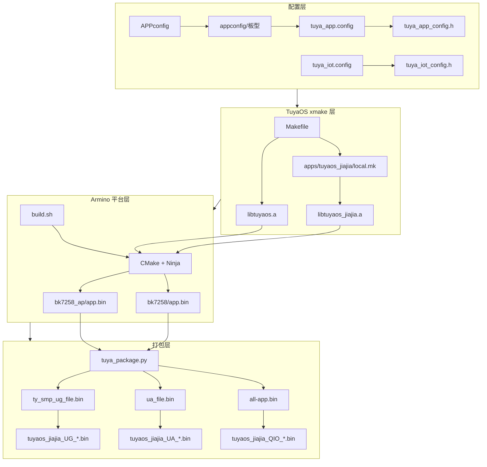

# tuyaos_jiajia 固件编译流程与产物说明

> **适用范围**：`tuyaos_jiajia` 应用在 T5（BK7258）平台上的完整编译链路，以产物  
> `apps/tuyaos_jiajia/output/<版本>/tuyaos_jiajia_QIO_<版本>.bin` 为例说明。  
> **构建根目录**（所有 `make` 命令均在此执行）：  
> `T5_TuyaOS-3.13.6/software/TuyaOS/`

---

## 一、总体概览

最终烧录固件由 **TuyaOS 上层构建（xmake）** 与 **BK7258 平台构建（Armino / CMake + Ninja）** 两级协作完成，再经 Python 打包脚本生成 QIO / UA / UG 三种产物。

```
配置加载 → 应用源码编译(.c→.o→.a) → 平台链接(ELF) → bin 提取 → 分区拼接 → OTA 打包 → 输出 QIO/UA/UG
```

| 产物后缀 | 含义 | 典型用途 |
|----------|------|----------|
| **QIO** | 全量 Flash 镜像（bootloader + CP + AP + 各分区） | 工厂烧录、USB 下载器 |
| **UA** | 用户区固件（BL2 + CP + AP，按分区填充对齐） | 涂鸦云整包 OTA |
| **UG** | UA 经 XZ 压缩并加涂鸦 OTA 头 | 涂鸦云压缩/差分 OTA |

示例（版本 `0.0.0`）：

```
apps/tuyaos_jiajia/output/0.0.0/
├── tuyaos_jiajia_QIO_0.0.0.bin   # 全量烧录
├── tuyaos_jiajia_UA_0.0.0.bin    # 用户区升级
├── tuyaos_jiajia_UG_0.0.0.bin    # OTA 升级包
└── debug/                        # ELF、map、sdkconfig 等调试文件
```

---

## 二、常用命令

在 `T5_TuyaOS-3.13.6/software/TuyaOS/` 下执行，`APP_NAME` 固定为 `tuyaos_jiajia`：

| 目的 | 命令 |
|------|------|
| 选择板型并加载默认配置 | `make app_config_choice APP_NAME=tuyaos_jiajia` |
| 交互式功能开关（menuconfig） | `make app_menuconfig APP_NAME=tuyaos_jiajia` |
| 根据 `tuya_app.config` 重新生成 `tuya_app_config.h` | `make app_config APP_NAME=tuyaos_jiajia` |
| **日常固件编译** | `make app APP_NAME=tuyaos_jiajia` |
| 重编 SDK 静态库（耗时长） | `make os APP_NAME=tuyaos_jiajia` |
| 清理应用输出 | `make clean APP_NAME=tuyaos_jiajia` |
| 清理应用 + SDK 静态库 | `make os_clean APP_NAME=tuyaos_jiajia` |

配置变更后若只改了 Kconfig 相关文件，需先执行 `make app_config`，再 `make app`。

---

## 三、编译步骤详解

### 3.1 配置加载

**触发**：`make app_config_choice` 或 `make app_config`。

**关键文件**：

| 文件 | 作用 |
|------|------|
| `apps/tuyaos_jiajia/build/APPconfig` | Kconfig 定义（菜单、默认值、`select` 依赖） |
| `apps/tuyaos_jiajia/build/appconfig/<板型>/` | 板型默认配置快照 |
| `apps/tuyaos_jiajia/build/tuya_app.config` | 当前生效的应用功能开关 |
| `apps/tuyaos_jiajia/include/tuya_app_config.h` | 供 C 代码使用的 `CONFIG_*` 宏 |
| `build/tuya_iot.config` | 全局 IoT / 音频子系统配置 |
| `vendor/T5/tuyaos/tuyaos_kernel.config` | 平台内核级配置补充 |
| `include/base/include/tuya_iot_config.h` | 由 `tuya_iot.config` 生成的全局头文件 |

**依赖关系**：

```
APPconfig (Kconfig 定义)
    ↓
appconfig/<板型>/  ──复制──►  tuya_app.config
    ↓ kconfiglib (scripts/mk/config.mk → app_config)
tuya_app_config.h  ──被──►  local.mk 的 ifeq() 与源码 #include 使用
```

`local.mk` 与 `tuya_app.config` 必须同步：改功能开关时既要改 config，也要确认 `local.mk` 中对应源文件是否已按宏编入。

---

### 3.2 TuyaOS 应用层编译（xmake）

**触发**：`make app` → `scripts/mk/app.mk` 中的 `app_by_name`（先完成本层，再进入平台构建）。

**顶层入口**：`software/TuyaOS/Makefile`

1. `include build/build_param` — 平台名、工具链、输出目录、版本号等  
2. `include scripts/mk/xmake.mk` — `.c → .o`、`.o → .a` 规则  
3. `include scripts/mk/definitions.mk` — 工具函数  
4. 递归 `include` 各组件 `local.mk`：  
   - `adapter/**/local.mk`  
   - `components/**/local.mk`  
   - **`apps/tuyaos_jiajia/local.mk`**（应用源码与宏的核心描述）  
   - `vendor/T5/tuyaos/tuyaos_adapter/local.mk`  
5. `include scripts/mk/app.mk` — 定义 `app` 目标  

**`local.mk` 主要职责**：

- 按 `CONFIG_T5AI_BOARD`、`CONFIG_ENABLE_TUYA_UI` 等条件选择 `.c` 与头文件路径  
- 注册 `LOCAL_TUYA_SDK_INC`、`LOCAL_TUYA_SDK_CFLAGS`  
- `include $(BUILD_STATIC_LIBRARY)` 生成静态库  

**中间产物**：

```
output/T5_tuyaos_jiajia/.objs/static/apps/tuyaos_jiajia/   # .o
output/T5_tuyaos_jiajia/lib/libtuyaos_jiajia.a             # 应用静态库
libs/libtuyaos_jiajia.a                                    # 拷贝供平台链接
libs/libtuyaos.a                                           # IoT SDK（需先 make os 或历史构建）
libs/libtuyaos_adapter.a                                 # 平台适配
```

**工具链**（`build/build_param`）：

```
vendor/T5/toolchain/gcc-arm-none-eabi-10.3-2021.10/bin/arm-none-eabi-gcc
```

目标：`-mcpu=cortex-m33 -mfpu=fpv5-sp-d16 -mfloat-abi=hard`（`vendor/T5/tuyaos/platform.mk` 可再叠加平台选项）。

---

### 3.3 BK7258 平台构建（Armino）

`app.mk` 在 TuyaOS 层静态库就绪后，进入 `vendor/T5/t5_os/build.sh`。

**入口配置**（`vendor/T5/tuyaos/build_path`）：

```
TUYA_APPS_BUILD_PATH=../t5_os/
TUYA_APPS_BUILD_CMD=build.sh
```

**`build.sh` 主要步骤**：

1. 设置环境变量：`TUYA_PROJECT_DIR`、`TUYA_APP_NAME`、`TUYA_APP_VERSION`  
2. 校验 `bootloader.bin` MD5  
3. Python 3.8+ 虚拟环境（`projects/tuya_app/tuya_build_env/`）  
4. 解析 `app_resource_config.json` → 生成 `usr_gpio_cfg.h`  
5. `tuya_partition_table_select.py` 选择分区表  
6. 核心编译：  
   ```bash
   make bk7258 PROJECT=tuya_app APP_NAME=tuyaos_jiajia APP_VERSION=0.0.0 -j
   ```  
7. 可选：分析 CP/AP 的 `app.elf` 内存占用  

**Armino 工程**：`vendor/T5/t5_os/projects/tuya_app/CMakeLists.txt` → CMake + Ninja。

BK7258 为双核方案：

| 核 | 构建目录 | 链接产物 | 烧录 bin |
|----|----------|----------|----------|
| **CP** | `build/bk7258/tuya_app/bk7258/` | `app.elf` | `app.bin` |
| **AP** | `build/bk7258/tuya_app/bk7258_ap/` | `app.elf` | `app.bin` |

应用业务代码（`libtuyaos_jiajia.a` 等）主要链接在 **AP** 核；CP 侧承担部分系统/通信能力。

**链接输入（概念上）**：

- `libs/libtuyaos_jiajia.a` — 应用  
- `libs/libtuyaos.a` — IoT SDK  
- `libs/libtuyaos_adapter.a` — TAL/TDD 适配  
- `libs/app_libs/*.a` — 闭源算法（如 KWS `libsndxasr.a`、AEC `libtutuClear.a`）  
- BK7258 SDK 预编译库与驱动（`cp/components/bk_libs/` 等）  

---

### 3.4 固件打包（QIO / UA / UG）

Armino 构建结束后，由 `projects/tuya_app/tuya_scripts/tuya_package.py`（通常由 `bk_build_package.py` 调用）完成打包。

**中间目录**：`vendor/T5/t5_os/build/bk7258/tuya_app/package/`

| 中间文件 | 说明 |
|----------|------|
| `all-app.bin` | 按 Flash 分区表拼接的完整镜像 → 复制为 **QIO** |
| `ua_file.bin` | `create_ua_file.py`：BL2 + CP + AP，分区填充 `0xFF` → **UA** |
| `ty_smp_ug_file.bin` | `create_ug_file`：UA 的 XZ 压缩 + 涂鸦 OTA 头 → **UG** |

**UA 拼接逻辑**（`create_ua_file.py`）：

- 读取 `partitions/bk7258/auto_partitions.csv`  
- 顺序写入：`bl2.bin` → 填充 → `bk7258/app.bin`（CP）→ 填充 → `bk7258_ap/app.bin`（AP）  

**UG**：对 UA 数据压缩并附加 magic `0x004D4D4D`、CRC32、长度等字段，供云端 OTA。

**复制到应用输出**（`tuya_package.py` → `copy_output_files`）：

```text
all-app.bin       → apps/tuyaos_jiajia/output/<ver>/tuyaos_jiajia_QIO_<ver>.bin
ua_file.bin       → apps/tuyaos_jiajia/output/<ver>/tuyaos_jiajia_UA_<ver>.bin
ty_smp_ug_file.bin → apps/tuyaos_jiajia/output/<ver>/tuyaos_jiajia_UG_<ver>.bin
```

`debug/` 下会保存 CP/AP 的 `app.elf`、`app.map`、`sdkconfig`、分区表等，便于排查链接与内存问题。

---

## 四、架构与依赖关系图



---

## 五、关键路径速查

| 类别 | 路径 |
|------|------|
| Make 根目录 | `T5_TuyaOS-3.13.6/software/TuyaOS/` |
| 构建参数 | `build/build_param` |
| 应用构建描述 | `apps/tuyaos_jiajia/local.mk` |
| 应用配置 | `apps/tuyaos_jiajia/build/tuya_app.config` |
| 平台构建脚本 | `vendor/T5/t5_os/build.sh` |
| Armino 工程 | `vendor/T5/t5_os/projects/tuya_app/` |
| 打包脚本 | `vendor/T5/t5_os/projects/tuya_app/tuya_scripts/tuya_package.py` |
| 分区表 | `vendor/T5/t5_os/projects/tuya_app/partitions/bk7258/auto_partitions.csv` |
| 工具链 | `vendor/T5/toolchain/gcc-arm-none-eabi-10.3-2021.10/` |
| 最终固件输出 | `apps/tuyaos_jiajia/output/<版本>/` |
| TuyaOS 编译中间输出 | `output/T5_tuyaos_jiajia/` |

---

## 六、环境与依赖

| 依赖 | 说明 |
|------|------|
| **gcc-arm-none-eabi 10.3** | 交叉编译器，路径见 `build/build_param` |
| **Python 3.8+** | kconfiglib、GPIO/分区/打包脚本 |
| **python3-venv** | `build.sh` 自动创建 `tuya_build_env` |
| **CMake + Ninja** | Armino 构建（随 `t5_os/tools` 提供） |
| **Bootloader** | `cp/components/bk_libs/bk7258/bootloader/.../bootloader.bin` |
| **BL2** | `projects/tuya_app/tuya_scripts/files/bl2.bin` |
| **闭源库** | `libs/app_libs/`（KWS、AEC 等，由 `local.mk` 在 T5 模块下拷贝） |

建议在 **Linux / WSL** 下开发：`build/appconfig/`（目录）与 `build/APPconfig`（文件）仅大小写不同，在大小写不敏感文件系统上可能冲突。

---

## 七、从零到 QIO 的完整命令序列

```bash
cd T5_TuyaOS-3.13.6/software/TuyaOS

# 1. 首次或切换板型
make app_config_choice APP_NAME=tuyaos_jiajia

# 2. 可选：图形化改功能
make app_menuconfig APP_NAME=tuyaos_jiajia

# 3. 配置变更后重新生成头文件
make app_config APP_NAME=tuyaos_jiajia

# 4. 编译并打包（内部依次：xmake → build.sh → Armino → tuya_package.py）
make app APP_NAME=tuyaos_jiajia
```

成功后可在 `apps/tuyaos_jiajia/output/0.0.0/`（版本号以 `build_param` / `APP_VER` 为准）找到 `tuyaos_jiajia_QIO_*.bin`。

---

## 八、相关文档

| 文档 | 路径 |
|------|------|
| 仓库级架构与开发指南 | `Docs/T5-Wukong-AI-架构与开发指南.md` |
| 板型说明 | `Docs/T5-Wukong-AI-Board类型说明.md` |
| 应用快速开始 | `apps/tuyaos_jiajia/docs/QUICKSTART_CN.md` |
| 配置与构建规则（Cursor） | 项目根 `CLAUDE.md`、`.cursor/rules/tuyaos-build.mdc` |
| 文档体系结构 | `apps/tuyaos_jiajia/docs/DOC_STRUCTURE.md` |

---

*文档基于 TuyaOS 3.13.6、`tuyaos_jiajia` 与 T5/BK7258 构建树整理；若 SDK 升级导致路径或脚本名变化，以仓库内实际文件为准。*
